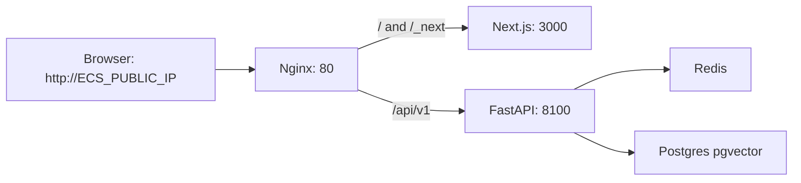

# ECS Ubuntu 部署指南（新系统）

本指南适用于当前首版上线场景：

- 服务器：阿里云 ECS，Ubuntu 系统盘
- 访问方式：暂时使用公网 IP + HTTP
- 部署范围：只部署新系统 `frontend` + `backend/run.py`
- 不部署旧系统 `viral_app.py`

## 服务拓扑



对外只开放 `80/tcp` 和 SSH 使用的 `22/tcp`。`3000`、`8100`、`5432`、`6379` 都不需要在安全组开放。

## 1. 阿里云安全组

在 ECS 安全组入方向放行：

- `22/tcp`：SSH 登录
- `80/tcp`：Web 访问

暂时不要放行：

- `3000/tcp`：前端容器只给 Nginx 内部访问
- `8100/tcp`：后端容器只给 Nginx 内部访问
- `5432/tcp`：Postgres 不对公网开放
- `6379/tcp`：Redis 不对公网开放

## 2. 安装 Docker

SSH 登录服务器后执行：

```bash
sudo apt update
sudo apt install -y ca-certificates curl git
sudo install -m 0755 -d /etc/apt/keyrings
curl -fsSL https://download.docker.com/linux/ubuntu/gpg | sudo tee /etc/apt/keyrings/docker.asc >/dev/null
sudo chmod a+r /etc/apt/keyrings/docker.asc
echo "deb [arch=$(dpkg --print-architecture) signed-by=/etc/apt/keyrings/docker.asc] https://download.docker.com/linux/ubuntu $(. /etc/os-release && echo "$VERSION_CODENAME") stable" | sudo tee /etc/apt/sources.list.d/docker.list >/dev/null
sudo apt update
sudo apt install -y docker-ce docker-ce-cli containerd.io docker-buildx-plugin docker-compose-plugin
sudo systemctl enable --now docker
```

验证：

```bash
docker --version
docker compose version
```

如果 ECS 内存较小（例如 2GB），建议先加 swap，避免首次构建 Chromium/Next 镜像时 OOM：

```bash
sudo fallocate -l 4G /swapfile
sudo chmod 600 /swapfile
sudo mkswap /swapfile
sudo swapon /swapfile
echo '/swapfile none swap sw 0 0' | sudo tee -a /etc/fstab
```

## 3. 拉取代码

```bash
sudo mkdir -p /opt/redmuse
sudo chown -R "$USER":"$USER" /opt/redmuse
cd /opt/redmuse
git clone <你的仓库地址> XHS_viral_notes
cd XHS_viral_notes
```

如果你不是通过 Git 部署，也可以把项目目录上传到 `/opt/redmuse/XHS_viral_notes`。

## 4. 准备生产环境变量

```bash
cp .env.production.example .env
```

编辑 `.env`：

```bash
nano .env
```

至少必须修改：

- `REDMUSE_JWT_SECRET`：生成随机值
- `POSTGRES_PASSWORD`：生产数据库密码
- `OPENAI_API_KEY`：文本模型 Key
- `EMBEDDING_API_KEY`：知识库向量化 Key
- `MULTIMODAL_API_KEY`：图文/视频分析 Key

生成 JWT 密钥：

```bash
python3 -c "import secrets; print(secrets.token_hex(32))"
```

当前 Nginx 同源反代方案下，保持：

```bash
NEXT_PUBLIC_API_BASE_URL=/api/v1
```

不要把它改回 `http://localhost:8100/api/v1`，否则浏览器会访问用户自己的电脑。

## 5. 构建并启动

首版上线只启动必要服务：

```bash
docker compose up -d --build redis postgres spider-xhs frontend nginx
```

查看状态：

```bash
docker compose ps
```

查看日志：

```bash
docker compose logs -f spider-xhs frontend nginx
```

## 6. 健康检查

在服务器上验证 API：

```bash
curl http://127.0.0.1/api/v1/health
```

验证首页：

```bash
curl -I http://127.0.0.1/
```

本地浏览器访问：

```text
http://ECS公网IP/
```

正常情况下会进入 RedMuse 前端页面，而不是 FastAPI JSON。

## 7. 首次登录和业务验证

1. 打开 `http://ECS公网IP/`
2. 扫码登录小红书账号
3. 进入 `/workspace`
4. 到 `/settings` 检查 Cookie 状态
5. 用少量关键词发起一次测试任务
6. 观察聊天区和 Canvas 是否持续更新

如果任务进度卡住，优先看后端日志：

```bash
docker compose logs -f spider-xhs
```

如果页面能打开但接口失败，看 Nginx 和前端构建变量：

```bash
docker compose logs -f nginx frontend
```

## 8. 升级部署

拉取新代码：

```bash
cd /opt/redmuse/XHS_viral_notes
git pull
```

重新构建受影响服务：

```bash
docker compose up -d --build spider-xhs frontend nginx
```

如果修改了 `.env` 中的模型 Key 或 JWT 密钥，也需要重启后端：

```bash
docker compose up -d --force-recreate spider-xhs
```

## 9. 可选：启用 ARQ Worker

当前首版建议保持：

```bash
TASK_RUNNER=inprocess
```

如果后续要切换到队列模式：

1. 修改 `.env`：

```bash
TASK_RUNNER=arq
```

2. 启动 worker：

```bash
docker compose --profile worker up -d arq-worker
```

3. 查看 worker 日志：

```bash
docker compose logs -f arq-worker
```

## 10. 常见问题

### 访问公网 IP 只看到 JSON

说明 Nginx 仍然把 `/` 反代到了后端。确认已经使用新版 `nginx/nginx.conf`，并重建/重启 Nginx：

```bash
docker compose up -d --force-recreate nginx
```

### 前端报请求 localhost 失败

说明前端构建时 `NEXT_PUBLIC_API_BASE_URL` 配错。确认 `.env` 中是：

```bash
NEXT_PUBLIC_API_BASE_URL=/api/v1
```

然后重建前端：

```bash
docker compose up -d --build frontend nginx
```

### 后端启动时报 JWT_SECRET 错误

生产环境必须设置：

```bash
REDMUSE_JWT_SECRET=<随机长密钥>
```

### Postgres 密码修改后无法登录

Postgres 首次初始化后会把账号写入 Docker volume。已经初始化过的数据库不会因为 `.env` 改密码而自动修改账号。

首版测试环境如果可以清空数据，可执行：

```bash
docker compose down
docker volume rm xhs_viral_notes_postgres-data
docker compose up -d --build redis postgres spider-xhs frontend nginx
```

生产数据不要直接删 volume。

### HTTP 明文风险

公网 IP + HTTP 可以用于首版自测，但 JWT、登录状态和接口内容会明文传输。正式给多人使用前，建议绑定域名并配置 HTTPS。
