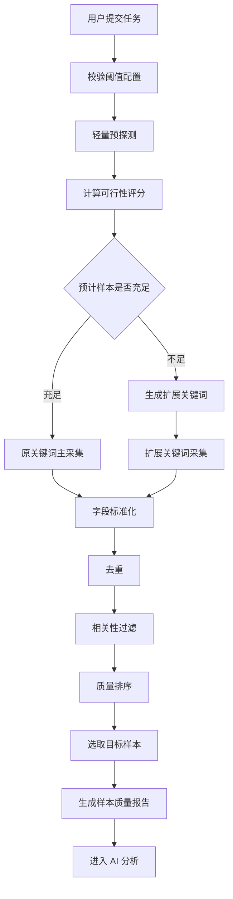

```markdown


# RED MUSE 笔记数据抓取逻辑设计

## 1. 总体原则

RED MUSE 的抓取逻辑不应只追求“凑够样本量”，而应在“样本量、相关性、爆款强度、时效性、采集风险”之间取得平衡。

核心目标：
- 优先保证样本与用户输入关键词的语义相关性。
- 在相关性足够的前提下，优先选择互动量高、发布时间近的笔记。
- 当平台可用样本不足时，只允许做“场景词、功效词、修饰词”的横向扩展，禁止替换核心品类。
- 任务开始前就向用户展示预期风险，而不是任务失败后才解释。
- 系统可以完成任务，但需要明确标注样本质量与洞察置信度。

## 2. 用户阈值配置引导

默认配置建议保留为：
- 笔记类型：不限
- 互动量：1000+
- 样本量：100
- 时间范围：半年内

这套默认值适合作为“推荐配置”，原因是它兼顾了爆款质量、样本规模、采集成功率与平台反爬风险。

在用户修改阈值时，系统应实时计算一个“任务可行性评分”，并在 UI 中给出提示。

可行性评分由以下因素组成：
- 笔记类型约束：不限风险最低，图文/视频单一类型风险更高。
- 互动量阈值：500+ 风险最低，1000+ 中等，5000+ 较高。
- 样本量：50 风险最低，80 中等，100 较高。
- 时间范围：半年内风险最低，一周内较高，一天内最高。
- 关键词热度：系统可基于历史任务、预采样结果或平台搜索结果估算。

建议将配置分为三档：
- 绿色：预计可稳定获得足量样本，正常执行。
- 黄色：预计样本可能不足，建议放宽时间范围、降低互动量或改为不限类型。
- 红色：预计无法获得足量高质量样本，但允许用户继续执行，并明确提示洞察结果可能偏窄或置信度较低。

## 3. 任务执行前的轻量预估

正式采集前，先执行一次低成本预探测。

预探测目标：
- 判断关键词下是否有足够结果。
- 判断不同时间范围内的笔记密度。
- 估算互动量阈值过滤后的剩余样本数量。
- 评估是否需要扩词或建议用户调整条件。

预探测不需要抓完整详情，只需抓搜索列表页的轻量字段：
- note_id
- title
- author_id
- note_type
- publish_time
- like_count
- collect_count
- comment_count
- cover_url
- note_url

互动量计算公式：
- interaction_score = like_count + collect_count + comment_count

预探测建议采集量：
- 每个原始关键词抓 20-30 条列表结果即可。
- 如果结果极少，再触发一轮扩词预探测。

## 4. 主采集流程

整体流程如下：



## 5. 样本充足时的筛选逻辑

当符合条件的笔记数量超过用户样本量时，不建议简单按互动量取 Top N，也不建议简单按发布时间取最新 N。

更合理的排序应为综合评分：

final_score = interaction_score_weighted + recency_score + relevance_score + diversity_score

建议权重：
- 互动量：45%
- 时间新鲜度：25%
- 关键词相关性：20%
- 作者/内容多样性：10%

这样可以避免两个问题：
- 只取互动量最高，可能拿到大量较旧内容，削弱趋势洞察。
- 只取最新内容，可能拿到互动量刚起量但尚未验证为爆款的内容。

推荐规则：
- 先过滤掉低于互动量阈值的笔记。
- 再过滤掉不在时间范围内的笔记。
- 再按综合评分排序。
- 最后取 Top 50 / 80 / 100。

如果用户明确选择“一天内/一周内”，时间新鲜度权重可提高到 35%，互动量权重下降到 35%。

## 6. 样本不足时的补样逻辑

样本不足时，不能直接降低标准，也不能替换品类词。应按“最小破坏原则”逐级扩展。

建议补样顺序：

第一层：原始关键词内扩展抓取
- 增加翻页深度。
- 扩大搜索排序方式，如综合、最新、最热。
- 保持用户阈值不变。

第二层：语义横向扩词
- 品类词 + 场景词：如“燕麦米 减脂”“燕麦米 控糖”。
- 品类词 + 人群词：如“燕麦米 糖尿病”“燕麦米 健身”。
- 品类词 + 功效词：如“燕麦米 饱腹”“燕麦米 低 GI”。
- 品类词 + 使用方式：如“燕麦米 早餐”“燕麦米 做法”。

第三层：受控放宽时间范围
- 仅在用户同意或 UI 预先授权的情况下触发。
- 例如从一周内放宽到一个月内，再到半年内。

第四层：受控降低互动量阈值
- 仅作为最后补样手段。
- 例如 10000+ 降到 5000+，5000+ 降到 1000+。
- 被降低阈值的样本必须打标，不能与原始达标样本混为一谈。

不建议自动放宽“笔记类型”：
- 如果用户选择视频，自动混入图文会改变内容结构分析结果。
- 可以在 UI 中建议用户改为“不限”，但不应静默改变。

## 7. 扩词边界规则

扩词必须围绕核心品类词，不能替换品类。

允许扩展：
- 场景词：减脂、控糖、早餐、健身、露营、通勤。
- 功效词：饱腹、低 GI、低卡、抗糖、健康饮食。
- 人群词：宝妈、学生党、健身人群、控糖人群。
- 内容形态词：测评、教程、合集、避坑、真实体验。
- 搭配词：燕麦米饭、燕麦米粥、燕麦米早餐。

禁止扩展：
- 品类替换：燕麦米 -> 大米、糯米、小米。
- 受众明显偏移：燕麦米 -> 主食饱腹、大米饭团。
- 价格/品牌过度偏移：如果用户没有指定品牌，不应扩成某个品牌词。

每个扩展词应有一个 semantic_distance 分数：
- 0：原始关键词。
- 1：强相关扩展，如“燕麦米 减脂”。
- 2：中相关扩展，如“燕麦米 早餐”。
- 3：弱相关扩展，默认不进入分析，除非样本严重不足且 UI 明确提示。

## 8. 去重机制

必须设置多层去重。

第一层：强 ID 去重
- note_id 相同，直接去重。
- note_url 标准化后相同，直接去重。

第二层：内容指纹去重
- title + author_id + publish_time 近似一致。
- title + cover_hash + author_id 近似一致。
- 正文摘要相似度超过阈值，例如 0.92。

第三层：跨关键词来源合并
- 同一笔记可能被多个扩展关键词抓到。
- 保留一个主记录，同时保存 matched_keywords 数组。
- 如果同一笔记被多个关键词命中，可提高 relevance_score。

第四层：疑似搬运/重复内容处理
- 不一定删除，但应降低 diversity_score。
- 如果标题高度相似、封面类似、作者不同，可作为同质化内容标记。

## 9. 样本质量分层

最终样本不应只有“够/不够”，还应有质量分层。

建议每条笔记打以下标签：
- source_type：原关键词 / 扩展关键词 / 放宽时间 / 降低互动量。
- threshold_status：完全达标 / 时间放宽 / 互动量放宽 / 语义扩展。
- relevance_level：强相关 / 中相关 / 弱相关。
- duplicate_status：唯一 / 合并重复 / 疑似同质化。
- confidence_level：高 / 中 / 低。

任务级别也应生成样本质量报告：
- 目标样本量。
- 实际采集样本量。
- 完全达标样本数量。
- 扩展关键词样本数量。
- 放宽阈值样本数量。
- 去重删除数量。
- 最终洞察置信度。

## 10. UI 提示机制

UI 不应只在失败时提示，而应在三个阶段提示。

配置阶段：
- 展示推荐配置。
- 展示当前配置的可行性评级。
- 对高风险组合给出明确解释。

示例：
“当前条件较严格：视频 + 10000+ 互动 + 一周内 + 100 篇。该组合可能导致样本不足，最终报告可能更偏向少量头部案例，而不是稳定的爆文规律。建议将时间范围放宽至半年内，或将样本量调整为 50。”

采集中阶段：
- 展示已找到多少条候选笔记。
- 展示是否正在启用扩展关键词。
- 展示是否触发去重、补样、阈值放宽。

完成阶段：
- 展示样本质量说明。
- 如果不足 100% 达标，不要隐藏，而是解释数据构成。

示例：
“本次目标样本量为 100，最终获得 100 条可分析笔记。其中 68 条完全符合原始条件，24 条来自强相关扩展关键词，8 条来自时间范围放宽。报告可用于提炼内容方向，但对短期爆发趋势的判断需谨慎。”

## 11. 不足样本的产品策略

系统不建议强行保证“任何情况下都凑够 100 篇”。更好的产品表达是：
- 目标样本量：用户期望数量。
- 有效样本量：严格符合条件的数量。
- 补充样本量：通过扩词或放宽获得的数量。
- 分析样本量：最终进入 AI 分析的数量。

如果最终仍不足，应允许进入分析，但报告需要标注“低样本置信度”。

建议最低分析门槛：
- 50 样本任务：至少 30 条有效样本。
- 80 样本任务：至少 50 条有效样本。
- 100 样本任务：至少 60 条有效样本。


## 12. 欠考虑风险补充

你原先的思路总体正确，但还需要补充以下点：

- 不能只按互动量排序，否则旧爆文会压过近期趋势。
- 不能只按时间排序，否则互动量尚未充分积累的新笔记会混入。
- 样本不足时不要静默降级，所有扩词、放宽、补样都要可解释。
- 扩词要有语义边界，尤其要保护“核心品类不被替换”。
- 样本不仅要去重，还要控制作者集中度，避免少数头部账号主导结论。
- 要区分“爆款分析”和“趋势探索”，样本不足时不应给出过强结论。
- 不同笔记类型的分析维度不同，视频与图文混合分析时要分层输出。
- 小红书互动量有时间累积效应，新笔记需要做时间归一化，否则不公平。

## 13. 推荐最终采集决策

最终建议采用这套决策逻辑：

1. 用户配置阈值。
2. 系统实时给出可行性评级与推荐调整。
3. 正式任务开始前做轻量预探测。
4. 若预计充足，按原关键词采集并综合排序取样。
5. 若预计不足，先扩展场景/功效/人群词，不替换品类。
6. 所有候选样本统一标准化、去重、相关性过滤。
7. 按互动量、时间新鲜度、相关性、多样性综合评分排序。
8. 样本仍不足时，按用户授权逐级放宽时间范围或互动量。
9. 最终生成样本质量报告。
10. AI 分析时根据样本质量决定报告置信度和表达强度。

这套逻辑能让 RED MUSE 从“机械抓够 N 篇笔记”升级为“可解释、可控、有质量分层的爆文样本构建系统”。

```

