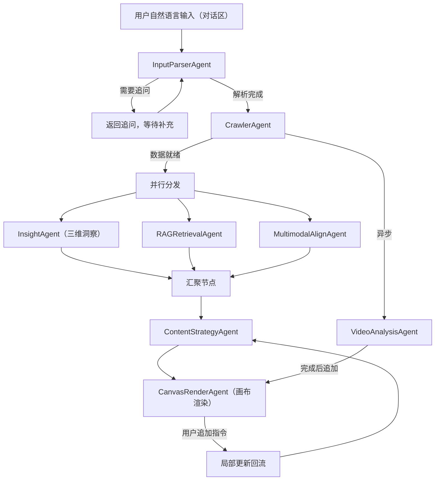
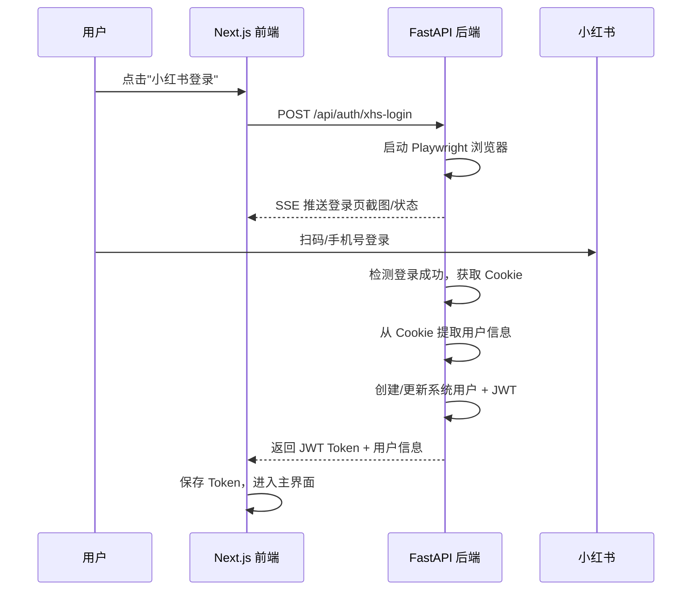

---

name: 爆文系统重构方案v3
overview: 基于用户三个核心需求（自然语言输入、登录合并、前端重构）和当前项目代码现状，输出一份完整的重构方案，涵盖前后端架构、Agent 重新设计、技术栈选型和分阶段实施路径。
todos:

- id: phase1-frontend-skeleton
content: 阶段1：搭建 Next.js 前端项目骨架（登录页/主工作台/路由/shadcn-ui）
status: pending
- id: phase1-backend-restructure
content: 阶段1：搭建 FastAPI 后端新目录结构（agents/services/models/prompts 分层）
status: pending
- id: phase1-login-merge
content: 阶段1：实现小红书账号直接登录系统（Playwright 扫码 → 用户创建 → JWT 签发）
status: pending
- id: phase1-input-parser
content: 阶段1：实现 InputParserAgent（自然语言意图解析 + 追问机制）
status: pending
- id: phase1-sse
content: 阶段1：打通 SSE 实时通信链路（后端推送 + 前端 EventSource）
status: pending
- id: phase1-db
content: 阶段1：PostgreSQL + Redis 基础配置与数据模型
status: pending
- id: phase2-langgraph
content: 阶段2：LangGraph 状态图搭建（7 个 Agent 节点注册 + 编排）
status: pending
- id: phase2-crawler
content: 阶段2：CrawlerAgent + 三层数据策略（Redis 缓存/ChromaDB 充足性/实时爬取）
status: pending
- id: phase2-semantic-rag
content: 阶段2：SemanticAnalysisAgent + RAGRetrievalAgent 实现
status: pending
- id: phase2-strategy
content: 阶段2：ContentStrategyAgent（支持 template_overrides 动态模板）
status: pending
- id: phase3-multimodal
content: 阶段3：MultimodalAlignAgent + VideoAnalysisAgent（Celery 异步）
status: pending
- id: phase3-report
content: 阶段3：ReportAgent 动态模板导出 + 前端结果展示
status: pending
- id: phase4-deploy
content: 阶段4：Docker Compose 部署 + 阿里云配置 + 知识库/历史页面
status: pending
isProject: false

---

# 红书爆文模型 AI Agent 系统重构方案 v3.0

基于三个核心变更需求和对当前代码的完整分析，输出本方案。

---

## 一、需求理解与核心变更点

### 变更 1：自然语言输入替代固定关键词

当前：用户手动输入最多 5 个关键词标签 + 配置参数，系统按固定维度生成固定格式的爆文模型。

目标：用户用自然语言描述需求，Agent 自动拆解为搜索关键词 + 分析偏好 + 模板定制。

### 变更 2：登录合并

当前：系统登录 + 小红书 Cookie 配置（两步）。

目标：小红书账号直接登录系统（一步）。

### 变更 3：产品架构从"搜索框"转向"Canvas 模式"

当前：输入框 → 等待 → 结果展示（单次交互）。

目标：左侧持续对话流（LUI）+ 右侧可交互结构化画布（GUI），支持多轮迭代。

来源：业务方案明确要求"从SEO逻辑的对话框转向Canvas模式"。

### 变更 4：分析维度从"统一特征"扩展为"三维洞察"

当前：对采集数据做统一的爆文特征提取。

目标：Agent 自动从采集数据中分三个维度分析——行业分析、竞品分析、本品分析。用户无需分别输入，由 Agent 从数据中自动识别和拆分。

来源：业务方案"洞察：行业分析、竞品分析、本品分析"。

### 变更 5：输出结构重新编排

当前：AI 洞察 → 爆文模型 → 数据总览。

目标：爆文模型框架（方法论+案例支撑）→ 多维洞察（行业/竞品/本品）→ 原始数据（交叉验证）。

来源：业务方案"参考业务模版，按照框架——洞察——原始数据的形式编排"。

### 变更 6：产品定位对齐

RED MUSE 的核心定位："只提供洞察和框架，赋能而非替代"。面向 B 端内容营销团队，不是 C 端个人运营工具。所有 UI 文案和功能设计必须体现这一定位。

### 变更 7：前端重构为企业级 Agent 框架

当前：Jinja2 + 原生 JS 单体 HTML。

目标：Next.js + React + Canvas 分屏交互，SSE 实时通信。

---

## 二、技术栈推荐

### 前端：Next.js 14+ (App Router)

推荐理由：

- 当前 Agent 产品主流选择（ChatGPT / Dify / Coze / LangFlow 等同类产品均基于 React 生态）
- App Router 原生支持 Server Components + Streaming，天然适配 LLM 流式输出
- 内置 API Routes 可做 BFF（Backend for Frontend），处理 SSE 转发和认证
- shadcn/ui + Tailwind CSS 提供企业级 UI 组件，开发效率高
- Vercel AI SDK 原生支持 LangGraph 的流式输出协议

前端核心依赖：

- Next.js 14+ (App Router)
- React 18+
- TypeScript
- Tailwind CSS + shadcn/ui
- Vercel AI SDK（useChat / useCompletion）
- Zustand（轻量状态管理）
- SWR（数据获取与缓存）
- Lucide Icons

### 后端：FastAPI + LangGraph + Redis + PostgreSQL

- FastAPI：继续使用，成熟稳定，与 LangGraph 兼容好
- LangGraph：Agent 编排核心，替代当前 BackgroundTasks 双轨编排
- Redis：缓存层（爬取记录缓存、任务状态、SSE 消息队列）
- PostgreSQL：替代 SQLite，支持并发和云部署
- Celery + Redis：视频分析等重型异步任务 + 定时爬虫任务
- ChromaDB：继续用于向量检索
- APScheduler / Celery Beat：定时爬虫调度（热榜词预热）

### AI 模型分工


| 用途                     | 推荐模型              | 说明           |
| ---------------------- | ----------------- | ------------ |
| 意图解析（InputParserAgent） | DeepSeek-Chat     | 拆解自然语言为结构化指令 |
| 语义分析                   | DeepSeek-Chat     | 标题/场景/情绪特征   |
| 多模态图文                  | Qwen3-VL-Plus     | 封面/图文对齐/产品识别 |
| 视频理解                   | Qwen3-VL-Plus     | 关键帧/时间轴      |
| 内容策略生成                 | DeepSeek-Chat     | 爆文模型核心生成     |
| 综合推理                   | DeepSeek-Chat     | 最终交付物        |
| 向量化                    | text-embedding-v4 | 全部文本向量化      |


---

## 三、Agent 重新设计

### 新增：InputParserAgent

这是本次最关键的新增 Agent，处于整个流水线最前端。

职责：

1. 接收用户自然语言输入
2. 提取搜索关键词（1-5 个）
3. 识别分析偏好（重点维度、忽略维度）
4. 识别模板定制要求（新增维度、格式偏好、输出风格）
5. 如果输入模糊，生成追问建议返回前端

输出结构：

```python
class ParsedIntent(TypedDict):
    keywords: List[str]           # 提取的搜索关键词
    search_config: dict           # note_type, time_range 等
    analysis_focus: List[str]     # 用户关注的分析维度
    template_overrides: dict      # 模板定制要求
    clarification_needed: bool    # 是否需要追问
    clarification_question: str   # 追问内容
```

### 完整 Agent 流水线




### Agent 清单（8 个）


| 顺序  | Agent                | 是否需要 LLM | 职责                                  |
| --- | -------------------- | -------- | ----------------------------------- |
| 0   | InputParserAgent     | 是        | 自然语言意图解析：提取关键词、品牌名、分析维度偏好、模板定制      |
| 1   | CrawlerAgent         | 否（规则）    | 三层数据策略（缓存→充足性→实时爬取），含基础品类库          |
| 2a  | InsightAgent         | 是        | **改名+扩展**，三维洞察：行业分析 + 竞品分析 + 本品分析   |
| 2b  | RAGRetrievalAgent    | 否（检索）    | 爆文规则和行业 SOP 检索                      |
| 2c  | MultimodalAlignAgent | 是（多模态）   | 封面/图文对齐/产品植入识别                      |
| 3   | VideoAnalysisAgent   | 是（多模态）   | 异步视频分析                              |
| 4   | ContentStrategyAgent | 是        | 综合三维洞察+RAG+多模态，生成爆文模型框架（含案例支撑+视觉主题） |
| 5   | CanvasRenderAgent    | 部分       | 将策略结果渲染为画布模块结构，支持局部更新和导出            |


### InsightAgent：三维洞察（原 SemanticAnalysisAgent 扩展）

原来的 SemanticAnalysisAgent 只做统一的爆文特征提取。根据业务方案要求，扩展为三维洞察：

1. 行业分析：该品类/关键词在小红书的整体市场情况，爆文的共性特征和趋势
2. 竞品分析：同品类其他品牌/产品的内容策略、爆文模式、差异化特征
3. 本品分析：如果用户提及了具体品牌/产品，分析其当前内容表现和机会点

注意：用户不需要分别输入三类信息。InputParserAgent 会从自然语言中提取品牌/产品名（如有），InsightAgent 再从采集数据中自动识别并拆分三维视角。如果用户没有提及具体品牌，本品分析维度自动跳过。

### CanvasRenderAgent：画布渲染（原 ReportAgent 扩展）

原来的 ReportAgent 只负责生成 Excel。根据 Canvas 模式要求，扩展为：

1. 将 ContentStrategyAgent 的输出结构化为画布模块
2. 每个模块支持独立更新（用户追加指令时只重新生成对应模块）
3. 支持导出为 Excel / JSON / PDF
4. 支持视觉主题动态应用

### InputParserAgent 与 ContentStrategyAgent 的联动

InputParserAgent 解析出的 `template_overrides` 会透传到 ContentStrategyAgent 和 ReportAgent：

- 如果用户说"重点分析标题钩子"，`analysis_focus = ["title_hooks"]`，ContentStrategyAgent 会在 prompt 中加重标题维度
- 如果用户说"输出模板里加上竞品对比"，`template_overrides = {"extra_sections": ["competitor_comparison"]}`，ReportAgent 会动态新增该 Sheet/区块
- 如果没有任何定制要求，使用当前已有的默认模板（即 `viral_model_prompts.py` 中的 `VIRAL_MODEL_TEMPLATE`）

### 动态视觉风格（模板配色自适应）

最终交付物（Excel 报告 + 前端结果展示页）的视觉风格不再固定，而是由大模型根据关键词语义和采集内容的调性动态生成。

原理：ContentStrategyAgent 在生成爆文策略时，额外输出一份视觉风格配置（不需要多一次 LLM 调用，在同一个 prompt 里多一个输出字段即可）：

```python
class VisualTheme(TypedDict):
    theme_name: str         # 如 "奶油巧克力"
    primary_color: str      # 主色，如 "#8B6914"
    secondary_color: str    # 辅色，如 "#F5E6CC"
    accent_color: str       # 强调色，如 "#D4A574"
    background_color: str   # 背景色，如 "#FFF8F0"
    text_color: str         # 正文色，如 "#3E2723"
    mood_keywords: str      # 情绪关键词，如 "温暖、柔和、甜蜜"
    font_style: str         # 字体风格建议，如 "圆润、亲切"
```

判断逻辑：大模型不是随机选颜色，而是从两个维度综合判断：

- 关键词本身的品类属性（"奶油巧克力" → 暖色/甜食系、"户外露营" → 自然/大地色、"数码科技" → 冷色/科技感）
- 采集到的爆文内容调性（如果热门笔记普遍是少女风/可爱风，配色会往粉色系偏移）

视觉主题的应用位置：

- Excel 报告：ReportAgent 拿到 VisualTheme 后，用 openpyxl 动态设置表头色、区块背景色、强调色、边框色等，替代当前硬编码的固定配色
- 前端结果展示页：Next.js 拿到 VisualTheme 后，通过 CSS 变量动态切换结果展示区的整体配色方案（主色 / 辅色 / 背景色等）
- 如果大模型未返回有效的 VisualTheme（解析失败或字段缺失），兜底使用默认主题配色

ContentStrategyAgent prompt 中增加的输出要求（示例）：

> "根据关键词的品类属性、采集到的爆文内容调性和目标受众审美偏好，生成一套视觉风格配置，包含主色、辅色、强调色、背景色、文字色、情绪关键词和字体风格建议。颜色使用十六进制值。"

LangGraph 状态中对应新增字段：

```python
class ViralAgentState(TypedDict):
    # ... 已有字段 ...
    visual_theme: Optional[VisualTheme]    # 动态视觉风格配置
```

---

## 四、登录系统重构

### 设计：小红书账号即系统账号




核心变化：

- 去掉独立的 admin/密码登录体系
- 小红书扫码/手机号登录成功后，后端自动：
  1. 获取 Cookie
  2. 用 Cookie 调用小红书用户信息接口获取 user_id / nickname
  3. 在系统中创建或匹配用户记录
  4. 签发 JWT
- 用户身份绑定小红书账号，Cookie 自动关联
- 保留 admin 角色概念（首个登录用户或指定用户为 admin）

### Cookie 过期预警机制

Cookie 有效期通常 1-2 周，平台侧不可控，系统需要主动检测并提前预警。

三层检测策略：

1. 被动检测：任何接口调用返回"未登录"时立即标记 Cookie 失效
2. 主动健康检查：后台每 4 小时调用一次 `/api/sns/web/v1/user/selfinfo` 验证 Cookie 是否仍然有效
3. 时间预警：Cookie 保存超过 5 天未更新时，前端显示"即将过期"警告

Cookie 状态枚举：

- `valid` — 有效（最近一次健康检查通过）
- `expiring_soon` — 即将过期（保存超过 5 天且未更新）
- `expired` — 已过期（健康检查失败或接口返回未登录）
- `unknown` — 未检测（刚启动，尚未执行健康检查）

前端展示规则：

- `valid`：侧边栏显示绿色圆点 + "Cookie 有效"
- `expiring_soon`：侧边栏显示黄色圆点 + "Cookie 即将过期，建议重新登录"，同时在主工作台顶部显示黄色横幅提醒
- `expired`：侧边栏显示红色圆点 + "Cookie 已过期"，主工作台显示红色横幅 + 重新登录按钮，禁止发起新的分析任务
- `unknown`：侧边栏显示灰色圆点 + "检测中..."

定时爬虫联动：

- 执行前先检查是否有任何 `valid` 状态的 Cookie
- 如果所有 Cookie 都是 `expired`，跳过本轮并记录原因
- 如果只有 `expiring_soon`，正常执行但记录警告

---

## 五、前端架构设计

### 页面结构

```
app/
  layout.tsx              # 全局布局（认证检查、主题）
  page.tsx                # 登录页（小红书扫码）
  (dashboard)/
    layout.tsx            # 已认证布局（侧边栏 + 顶栏）
    page.tsx              # 主工作台（自然语言输入 + 分析）
    history/
      page.tsx            # 历史任务列表
    knowledge/
      page.tsx            # 知识库管理
    settings/
      page.tsx            # 系统设置
```

### 主工作台设计：Canvas 分屏模式

整体布局为左右分屏：

左侧：对话区（LUI）

- 持续对话流，用户可以多轮输入
- 首次进入时显示欢迎语和引导提示
- 输入框在底部，类似聊天界面
- Agent 执行进度以对话气泡形式内嵌展示
- 用户可以在任何时候追加指令修改画布内容

右侧：画布区（GUI）

- 初始状态为空白引导页
- Agent 完成后渲染为结构化模块看板
- 内容按"框架 → 洞察 → 原始数据"编排：
  - 爆文模型框架（方法论 + 案例支撑）
  - 多维洞察（行业分析 / 竞品分析 / 本品分析）
  - 原始数据（交叉验证依据）
- 每个模块支持操作：折叠/展开、重新生成、深入分析
- 画布整体应用动态视觉主题（VisualTheme）
- 底部导出栏：Excel / JSON / PDF

对话区与画布区的联动：

- 用户在对话区说"标题策略再展开"→ 只更新画布中"标题策略"模块
- 用户说"加上跟XX品牌的竞品对比"→ 画布中竞品分析模块追加内容
- 用户说"换一个更偏教程向的风格"→ ContentStrategyAgent 重新生成，画布整体更新

### 实时通信：SSE

替代当前 500ms 轮询，改为后端主动推送：

```typescript
// 前端
const eventSource = new EventSource(`/api/task/${taskId}/stream`);
eventSource.onmessage = (event) => {
  const data = JSON.parse(event.data);
  switch (data.type) {
    case 'agent_start':    // Agent 开始执行
    case 'agent_complete': // Agent 完成
    case 'stream_token':   // LLM 流式输出
    case 'progress':       // 进度更新
    case 'done':           // 全部完成
    case 'error':          // 错误
  }
};
```

---

## 五-B、定时爬虫预热机制

### 设计思路（沿用 v2）

除了用户触发的在线爬虫（CrawlerAgent），系统后台运行定时爬虫任务，自动抓取小红书热榜/热搜关键词的数据并预热到 ChromaDB，使得用户提交常见关键词时能直接命中缓存，无需等待实时爬取。

### 工作方式

```
定时爬虫（Celery Beat / APScheduler）
  │
  ├── 每 6 小时：抓取小红书热搜 / 热榜 Top 50 关键词
  │     ↓
  │   对每个关键词执行三维度采集（点赞/评论/收藏各 20 条）
  │     ↓
  │   清洗 → 写入 ChromaDB viral_posts Collection
  │     ↓
  │   更新 Redis 缓存标记（keyword + timestamp）
  │
  ├── 每 24 小时：扫描管理员配置的「重点关注词」列表
  │     ↓
  │   对每个关注词执行完整采集（最多 100 条）
  │     ↓
  │   同上入库
  │
  └── 数据老化：超过 30 天的预热数据自动降低权重（不删除）
```

### 与 CrawlerAgent 三层策略的关系

```
用户提交关键词
  ↓
CrawlerAgent 判断：
  ├── 第一层：Redis 缓存命中（定时爬虫已预热）→ 跳过，< 1s
  ├── 第二层：ChromaDB 已有 >= 30 条 → 跳过，< 1s
  └── 第三层：无数据 → 实时爬取
```

定时爬虫的核心价值是让第一层和第二层的命中率尽可能高，减少用户等待。

### 管理界面需求

系统设置页需要提供：

- 定时爬虫开关（启用/停用）
- 爬取频率配置（默认 6 小时）
- 重点关注词列表管理（手动添加/删除）
- 最近爬取记录和状态（成功/失败/上次执行时间）
- 预热数据量统计

---

## 六、后端架构设计

### 分层

```
backend/
  app/
    main.py                    # FastAPI 入口
    api/
      auth.py                  # 小红书登录 + JWT
      task.py                  # 任务 CRUD + SSE
      knowledge.py             # 知识库管理
      export.py                # 导出
    agents/
      graph.py                 # LangGraph 状态图定义
      input_parser.py          # InputParserAgent
      crawler.py               # CrawlerAgent
      semantic.py              # SemanticAnalysisAgent
      rag.py                   # RAGRetrievalAgent
      multimodal.py            # MultimodalAlignAgent
      video.py                 # VideoAnalysisAgent
      strategy.py              # ContentStrategyAgent
      report.py                # ReportAgent
    services/
      xhs_browser.py           # Playwright 浏览器管理（登录+采集）
      xhs_client.py            # 小红书 API 客户端
      knowledge_retriever.py   # 统一知识检索
      rag_service.py           # ChromaDB RAG
      export_service.py        # Excel/JSON 导出
    models/
      user.py                  # 用户模型（PostgreSQL）
      task.py                  # 任务模型
      viral_note.py            # 爆文数据模型
    prompts/
      input_parser.py          # 意图解析 prompt
      semantic.py              # 语义分析 prompt
      strategy.py              # 策略生成 prompt（支持 template_overrides 注入）
      viral_model.py           # 爆文模型 prompt
    config/
      settings.py              # 统一配置（Pydantic Settings）
      knowledge_base.json      # 领域知识
```

### LangGraph 状态定义

```python
class ViralAgentState(TypedDict):
    task_id: str
    raw_input: str                          # 用户原始自然语言输入
    parsed_intent: Optional[ParsedIntent]   # InputParser 输出
    keywords: List[str]
    config: dict
    analysis_focus: List[str]               # 用户关注的维度
    template_overrides: dict                # 模板定制要求
    
    task_status: str
    data_source: str
    
    crawler_result: Optional[dict]
    semantic_features: Optional[dict]
    multimodal_results: Optional[dict]
    video_analysis: Optional[dict]
    rag_context: Optional[dict]
    content_strategy: Optional[dict]
    
    excel_report_path: Optional[str]
    ai_insights: Optional[str]
    
    errors: Annotated[List[str], operator.add]
```

### 数据库

PostgreSQL 替代 SQLite，核心表：

- `users`：小红书 user_id / nickname / role / cookie / created_at
- `tasks`：task_id / user_id / raw_input / parsed_intent / status / data_file / analysis_file
- `task_logs`：task_id / timestamp / level / message（替代内存日志队列）

---

## 七、自然语言输入与对话引导设计

### 对话区首次进入引导

用户首次进入主工作台时，对话区显示欢迎语：

```
欢迎使用 RedMuse

告诉我你想分析什么品类或产品的爆文，我会自动完成数据采集、多维洞察和爆文模型生成。

你可以试试这样说：
```

下方显示可点击的示例标签：

- "分析「防脱精华」的爆文标题套路，重点看情绪钩子"
- "帮我研究「奶油巧克力」品类的爆款内容结构"
- "对比「完美日记」和「花西子」在小红书的爆文策略差异"
- "最近一周「露营装备」的爆款笔记有什么规律"

### InputParserAgent 的 prompt 策略

系统 prompt 要求模型：

1. 从用户输入中提取 1-5 个搜索关键词
2. 识别品牌/产品名（用于本品分析和竞品分析）
3. 识别时间范围暗示
4. 识别笔记类型暗示
5. 识别分析重点
6. 识别模板定制
7. 如果信息不足，生成友好的追问

输出结构扩展：

```python
class ParsedIntent(TypedDict):
    keywords: List[str]           # 搜索关键词
    brand_names: List[str]        # 品牌/产品名（用于竞品和本品分析）
    search_config: dict           # note_type, time_range 等
    analysis_focus: List[str]     # 关注的分析维度
    template_overrides: dict      # 模板定制要求
    clarification_needed: bool    # 是否需要追问
    clarification_question: str   # 追问内容
```

### 多轮对话交互

Canvas 模式下，对话不是"一次性"的。用户可以在画布生成后继续追加指令：

- "标题策略部分再详细一些" → 只更新画布中标题策略模块
- "加上跟XX品牌的竞品对比" → InsightAgent 追加竞品分析
- "我觉得行业分析不太准确，能重新分析一下吗" → InsightAgent 重跑行业维度
- "把这个导出成 Excel" → CanvasRenderAgent 生成导出文件

### 画布区内容结构（"框架 → 洞察 → 原始数据"）

画布区的模块顺序遵循业务方案要求：

第一层：爆文模型框架

- 标题策略（方法论 + 案例支撑）
- 内容结构（方法论 + 案例支撑）
- 封面视觉策略
- 产品植入时机
- 创作检查清单
- 视觉主题（动态配色）

第二层：多维洞察

- 行业洞察：该品类的市场概况、爆文共性特征、趋势判断
- 竞品洞察：同品类其他品牌的内容策略和差异化特征
- 本品洞察：用户指定品牌的内容表现和机会点（如有）

第三层：原始数据验证

- TOP 互动笔记列表
- 笔记类型分布
- 互动数据统计
- 标注："以下数据仅用于验证模型结论"

每个模块的操作按钮：

- 折叠/展开
- 重新生成（调用 Agent 局部更新）
- 深入分析（展开更多细节）

---

## 八、实施路径

### 阶段 1：基础骨架（2 周）

- 搭建 Next.js 前端项目骨架（登录页 + 主工作台 + 路由）
- 搭建 FastAPI 后端新目录结构
- 实现小红书登录合并（Playwright 扫码 → JWT）
- InputParserAgent 实现（DeepSeek 意图解析）
- SSE 通信链路打通（前后端）
- PostgreSQL + Redis 基础配置

### 阶段 2：核心 Agent 流水线（2 周）

- LangGraph 状态图搭建（7 个 Agent 节点注册）
- CrawlerAgent + 三层数据策略
- SemanticAnalysisAgent + RAGRetrievalAgent
- ContentStrategyAgent（支持 template_overrides）
- 端到端跑通：自然语言输入 → 爆文模型输出

### 阶段 3：多模态与导出（2 周）

- MultimodalAlignAgent
- VideoAnalysisAgent（Celery 异步）
- ReportAgent（动态模板 Excel 导出）
- 前端结果展示区完善（Tab 切换 / 流式输出 / 导出）

### 阶段 4：工程化与部署（1 周）

- Docker Compose（Next.js + FastAPI + PostgreSQL + Redis + ChromaDB）
- 阿里云部署配置
- 知识库管理页面
- 历史任务页面
- 错误监控与日志

---

## 九、与 v2 方案的核心差异对照


| 维度       | v2 方案             | v3 方案（本次）                                                       |
| -------- | ----------------- | --------------------------------------------------------------- |
| 产品定位     | 工具型产品             | B 端爆款洞察与框架智能代理（赋能而非替代）                                          |
| 产品形态     | 搜索框 → 结果展示        | Canvas 模式（左对话 + 右画布）                                            |
| 用户输入     | 固定关键词标签 + 参数配置    | 自然语言输入 + 多轮对话迭代                                                 |
| Agent 数量 | 6 个               | 8 个（+InputParser, +CanvasRender, SemanticAnalysis→InsightAgent） |
| 分析维度     | 统一爆文特征提取          | 三维洞察：行业/竞品/本品                                                   |
| 输出结构     | AI 洞察 → 爆文模型 → 数据 | 框架（方法论+案例）→ 洞察（三维）→ 原始数据（验证）                                    |
| 输出编辑     | 只读                | 画布上模块级操作（折叠/重新生成/深入分析）                                          |
| 爆文模型     | 只有方法论             | 方法论 + 案例支撑                                                      |
| 视觉风格     | 固定配色              | 大模型动态生成配色                                                       |
| 登录       | 系统登录 + Cookie 配置  | 小红书账号直接登录                                                       |
| 前端       | Jinja2 + 原生 JS    | Next.js + React + Canvas 分屏                                     |
| 通信       | 500ms 轮询          | SSE 实时推送                                                        |
| 数据库      | SQLite            | PostgreSQL                                                      |
| 缓存       | 内存字典              | Redis                                                           |
| 基础数据     | 无                 | 10 品类各 100 篇预置数据库                                               |
| 任务编排     | BackgroundTasks   | LangGraph + checkpoint                                          |
| 合规       | 未提及               | 不复用原始数据，仅提取规律性特征                                                |
| 部署       | 单体 Python         | Docker Compose                                                  |


