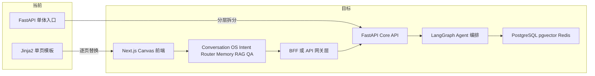

---

name: RedMuse重构总计划
overview: 基于当前 `prototypes` 的5个页面原型和现有单体代码，采用“同仓双轨（不新建独立仓库）+ 分阶段切流”完成 RedMuse 的前后端重构与必要重写。计划优先保障登录合并、对话中枢、Canvas 工作台和任务链路稳定，再逐步替换旧页面与旧接口。
todos:

- id: freeze-ui-contract
content: 冻结5个prototypes页面的数据契约与交互事件清单
status: pending
- id: scaffold-new-frontend-backend
content: 创建Next.js前端与FastAPI分层后端骨架，保持旧系统并行可用
status: completed
- id: merge-xhs-login
content: 完成小红书登录合并与Cookie状态体系（valid/expiring/expired/unknown）
status: completed
- id: build-canvas-workspace
content: 落地Conversation OS + Canvas工作台主链路（多轮对话-意图路由-任务/问答-进度-结果）与模块级操作
status: pending
- id: build-conversation-os
content: 新增会话、消息、摘要记忆、意图路由与普通问答能力，让工作台左侧从一次性输入升级为多轮对话中枢
status: pending
- id: conversation-memory-rag
content: 将知识库检索接入对话中枢，支持识别知识库问答并基于RAG片段生成带引用回答
status: pending
- id: route-chat-to-agent-task
content: 让对话意图可路由到现有小红书爆文多Agent任务，并把task_id与当前conversation绑定
status: pending
- id: replace-polling-with-sse
content: 将核心任务状态与日志从轮询迁移为SSE推送
status: pending
- id: deliver-management-pages
content: 完成历史任务、知识库、系统设置三页独立路由化重构
status: pending
- id: split-monolith-api
content: 将viral_app.py拆分为api/agents/services/models分层并保持兼容
status: pending
- id: upgrade-agent-orchestration
content: 完成自然语言到结果渲染的可编排Agent状态图与异步视频支路
status: pending
- id: migrate-infra-storage
content: 推进任务与日志存储从SQLite向PostgreSQL迁移并接入Redis缓存
status: pending
- id: gray-release-cutover
content: 按管理员灰度到全量切流并下线旧前端重逻辑
status: pending
isProject: false

---

# RedMuse 前后端重构总计划（基于 prototypes）

## 现状结论（已对齐你的 UI 稿）

- 登录页目标已明确：以 [prototypes/01-login.html](prototypes/01-login.html) 为准，走“小红书登录即系统登录”，包含扫码和手机号两入口。
- 主工作台目标已升级：以 [prototypes/02-workspace.html](prototypes/02-workspace.html) 为基础，采用“左对话中枢 + 右 Canvas”双栏。左侧不再只是一次性任务输入框，而要支持普通问答、知识库问答、触发爆文模型任务、后续追加指令和任务进度消息混排；右侧继续承载可持久化 Canvas。
- 管理页目标已明确：历史任务、知识库、设置分别对应 [prototypes/03-history.html](prototypes/03-history.html)、[prototypes/04-knowledge.html](prototypes/04-knowledge.html)、[prototypes/05-settings.html](prototypes/05-settings.html)。
- 当前系统仍是“单体入口 + 单页模板”形态，主要集中在 [viral_app.py](viral_app.py) 和 [web/templates/index.html](web/templates/index.html)，并且任务状态大量依赖轮询。
- 后端已有可复用资产：任务生命周期在 [viral_agent/task/manager.py](viral_agent/task/manager.py)，扫码登录能力在 [viral_agent/services/auth/api_qrcode_login_service.py](viral_agent/services/auth/api_qrcode_login_service.py)，多关键词采集在 [viral_agent/services/core/viral_collector.py](viral_agent/services/core/viral_collector.py)，分析能力在 [viral_agent/services/core/viral_analyzer.py](viral_agent/services/core/viral_analyzer.py)，知识库与 RAG 检索能力在新后端 [backend/app/api/routes/knowledge.py](backend/app/api/routes/knowledge.py) 与 [backend/app/application/agents/rag_agent.py](backend/app/application/agents/rag_agent.py) 中已具备基础。

## 当前进度口径（2026-04-27）

- 新后端与新前端主线已经完成阶段 4 的主要能力闭环：4.0 编排骨架、4.1 真实 Agent、4.α 缓存/ARQ/pgvector、4.2 视频、4.3pre 画布/Excel 重构、4.3 段落反馈闭环均已完成。
- 原计划中的“4.4 追加指令回流”已升级并完成为“4.4 对话中枢与意图路由”：`Conversation` / `Message` / 上下文摘要 / 用户侧 Knowledge QA / Task Handoff / `refine_canvas` 子能力均进入新后端主线。
- 4.5 旧入口拆分、4.6 PostgreSQL 业务表迁移、4.7 可观测与 Eval 已完成；业务 Store、conversation/message、RAG chunks 已切 PostgreSQL，幂等已切 Redis，RAG 向量主链路已从 ChromaDB 切到 pgvector。
- 下一步确认 4.8 Feature Flag DB 化是否跳过；若无需用户白名单、运行时热切换和审计，则直接进入 4.9 最终验收与发布收口。

## 重构策略（默认采用）

- 采用“**同仓双轨，不新开独立仓库**”：在当前仓库内新增 `frontend/` 与 `backend/`，旧系统保留为兼容轨道。
- 采用“**双轨迁移**”：新前端和新 API 并行开发，旧页面继续可用，避免一次性重写导致业务停摆。
- 采用“**接口先行**”：先冻结 UI 需要的数据契约，再拆分后端接口，最后接入新前端页面。
- 采用“**模块切流**”：按页面逐步切换（登录 → 工作台 → 历史 → 知识库 → 设置），每切一个模块即验收并回归。
- 采用“**能力复用优先**”：优先复用已有 task/auth/collector/analyzer 核心能力，UI 层和编排层重构为主。

## 项目边界决策（已确认）

- 默认路径：**在当前代码仓展开重构，不新建独立项目/独立仓库**。
- 新代码落点：`frontend/`（Next.js）+ `backend/`（FastAPI 分层），并逐步承接现有 `viral_agent` 能力。
- 旧代码角色：`viral_app.py` + `web/templates/index.html` 作为过渡与回退通道，直到新系统全量切流完成。
- 仅在以下条件同时满足时再考虑新仓：运维隔离强诉求、发布节奏完全独立、且已有稳定跨仓共享包方案。

## 分阶段实施（8 周）

### 阶段 0（第 1 周）：契约冻结与骨架搭建

- 冻结 5 个原型页面的数据契约和交互事件（按钮、状态、模块动作）。
- 定义统一事件模型：任务状态、日志流、Agent 节点进度、Cookie 状态。
- 创建新目录骨架：`frontend/`（Next.js）与 `backend/app/`（FastAPI 分层）。
- 保留旧入口 [viral_app.py](viral_app.py) 作为兼容层，仅做转发与兜底。

验收标准：

- 页面契约文档定稿；新工程可启动；旧功能不受影响。

### 阶段 1（第 2-3 周）：登录与会话体系重构

- 按 [prototypes/01-login.html](prototypes/01-login.html) 实现新登录页。
- 复用 [viral_agent/services/auth/api_qrcode_login_service.py](viral_agent/services/auth/api_qrcode_login_service.py) 的扫码会话能力，完成“小红书账号=系统账号”。
- 将旧密码登录接口从主链路降级为应急入口（管理员可保留）。
- 落地 Cookie 三态/四态检查（valid/expiring/expired/unknown）并回传到前端。

验收标准：

- 用户可扫码直接进入系统；Cookie 状态在 UI 实时可见；过期时阻止新任务。

### 阶段 2（第 4-5 周）：Conversation OS + Canvas 工作台重构（核心）

- 按 [prototypes/02-workspace.html](prototypes/02-workspace.html) 实现 LUI+GUI 分屏工作台，其中 LUI 是真正的多轮对话中枢，而不是一次性任务入口。
- 先实现“读链路”：会话创建、消息列表、普通问答、知识库问答、任务创建、进度展示、结果渲染。
- 再实现“写链路”：模块重生成、段落编辑标注、模块删除与恢复，以及通过对话追加指令触发局部更新。
- 新增意图路由：`general_qa` 普通问答、`knowledge_qa` 知识库问答、`xhs_analysis` 小红书爆文模型任务、`refine_canvas` 画布局部调整、`export` 导出。
- 新增上下文记忆：保存会话消息、当前摘要、最近任务/画布引用；已在 4.6 迁移时并入 PostgreSQL 业务表。
- 把旧轮询模式逐步替换为 SSE 主推送（任务进度、日志、阶段状态）。
- 复用 [viral_agent/task/manager.py](viral_agent/task/manager.py) 的暂停/恢复/取消能力。

验收标准：

- 对话区可连续发送多轮消息；普通问题能直接回答；知识库问题能基于 RAG 片段回答；爆文模型需求能触发现有多 Agent 任务并生成 Canvas；SSE 正常推送；模块级操作可闭环。

### 阶段 3（第 6 周）：历史、知识库、设置三页落地

- 按 [prototypes/03-history.html](prototypes/03-history.html) 重做历史任务页，支持筛选、重试、导出。
- 按 [prototypes/04-knowledge.html](prototypes/04-knowledge.html) 重做知识库页，串联领域规则和文档上传检索。
- 按 [prototypes/05-settings.html](prototypes/05-settings.html) 重做系统设置页，统一模型配置、定时预热、用户管理。
- 将旧页面中模态弹窗式管理（知识库、设置）迁移为独立路由页。

验收标准：

- 三个页面可独立访问并完整操作；权限控制与原系统一致。

### 阶段 4（第 7-8 周）：后端分层与 Agent 编排升级

- 将 [viral_app.py](viral_app.py) 拆为 `api/`、`agents/`、`services/`、`models/` 分层。
- 把自然语言解析、采集、洞察、策略、渲染串成状态图；保留视频分析异步支路。
- 在固定多 Agent 编排前增加 `ConversationController` / `IntentRouter`：普通问答直接走 `ModelGateway`，知识库问答走用户侧 RAG QA，爆文分析需求再进入现有 `Task` + 编排引擎。
- 新增对话域对象：`Conversation`、`Message`、`KnowledgeCitation`、`TaskHandoff`，并与 `TaskRecord` 通过 `active_task_id` / `linked_task_id` 关联。
- 复用 [viral_agent/services/core/viral_collector.py](viral_agent/services/core/viral_collector.py) 与 [viral_agent/services/core/viral_analyzer.py](viral_agent/services/core/viral_analyzer.py) 作为稳定内核，外层重构为可编排节点。
- 统一任务存储和日志存储，业务表已在 4.6 迁移到 PostgreSQL，缓存与幂等统一接入 Redis。

验收标准：

- 新编排链路可替代旧链路；对话 API 能稳定区分普通问答、知识库问答和爆文模型任务；核心 API P95 延迟和成功率达到发布门槛。

## 发布与切流策略

- 先灰度开放给管理员账号，再逐步放开到全量用户。
- 每个阶段保留回退开关（页面级、接口级、任务编排级）。
- 切流完成后下线 [web/templates/index.html](web/templates/index.html) 的重逻辑，仅保留维护页或跳转页。

## 风险与防护

- 最大风险：工作台交互复杂度高导致联调周期拉长；通过“先读后写、先主流程后高级编辑”分层交付。
- 次级风险：扫码登录稳定性波动；通过会话超时重试、手动刷新二维码、降级登录入口缓冲。
- 数据风险：任务状态迁移与旧任务兼容；通过版本化状态结构和迁移脚本分批处理。

## 本计划优先改动文件（第一批）

- 旧前端基线： [web/templates/index.html](web/templates/index.html)
- 旧后端入口： [viral_app.py](viral_app.py)
- 可复用任务控制： [viral_agent/task/manager.py](viral_agent/task/manager.py)
- 可复用扫码登录： [viral_agent/services/auth/api_qrcode_login_service.py](viral_agent/services/auth/api_qrcode_login_service.py)
- 可复用采集分析： [viral_agent/services/core/viral_collector.py](viral_agent/services/core/viral_collector.py)、[viral_agent/services/core/viral_analyzer.py](viral_agent/services/core/viral_analyzer.py)
- UI 目标来源： [prototypes/01-login.html](prototypes/01-login.html)、[prototypes/02-workspace.html](prototypes/02-workspace.html)、[prototypes/03-history.html](prototypes/03-history.html)、[prototypes/04-knowledge.html](prototypes/04-knowledge.html)、[prototypes/05-settings.html](prototypes/05-settings.html)

