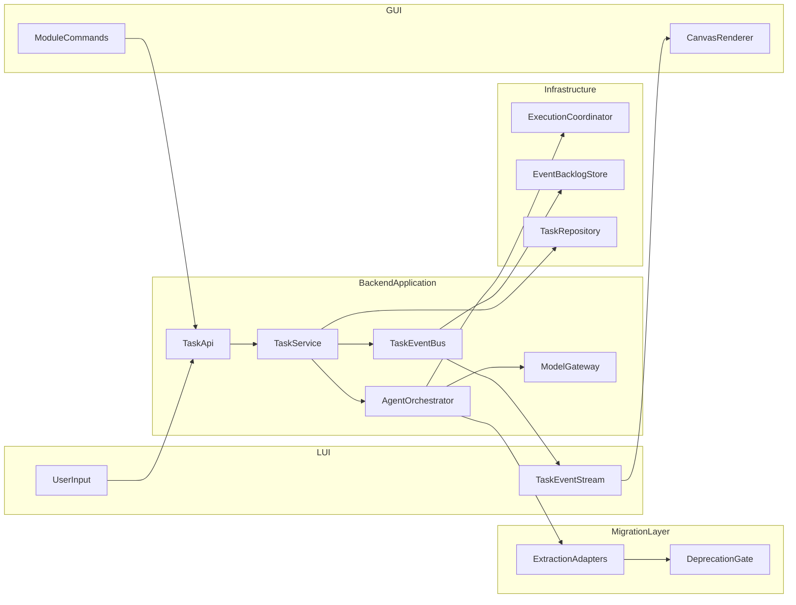

# 阶段2子阶段实施蓝图（Canvas + 多Agent）

## 范围统一（先解决口径冲突）

- 以总计划中的阶段2为主交付：`LUI+GUI工作台 + 读写链路 + SSE + 模块级闭环`。
- 同步吸收 v3 的阶段2核心能力，但按“最小可用编排”落地：`Crawler -> Semantic/RAG -> Strategy` 先接入，视频异步支路保留阶段3/4扩展。
- 阶段2不做：全量后端拆层完成态、全量基础设施迁移（PostgreSQL/Redis 全替换）、完整多模态视频深度分析、Ragas/Promptfoo 深度语义评估、Feature Flag 灰度。

## 架构原则（企业级，低冗余）

- **分层固定**：`API -> Application(UseCase) -> Domain -> Infrastructure/Adapters`。
- **IoC（Python化）**：通过 FastAPI `Depends` + Provider 模块统一注入服务（TaskService、AgentOrchestrator、EventBus、Repository）。
- **AOP（Python化）**：用装饰器/中间件统一处理鉴权、日志、追踪ID、异常包装、重试与超时。
- **迁移策略**：`白名单复用 -> 代码提取到新层 -> 回归通过 -> 删除旧调用链/旧文件`，不为兼容而保留整套旧架构。
- **模型调用单入口**：所有 Agent 只能通过 `ModelGateway` 访问大模型，禁止业务代码直接 `OpenAI()`。
- **配置分层**：`ProviderConfig(密钥/端点)`、`ModelProfile(参数模板)`、`AgentModelPolicy(Agent->Profile)` 三层解耦。
- **LangChain 策略**：阶段2不强依赖；后续若引入，仅作为 `ModelGateway` 的可插拔适配层，不影响业务节点接口。
- **并发策略**：阶段2同步落地“最小并发骨架”（可测试、可观测、可取消），`ExecutionCoordinator` 归属基础设施层（`backend/app/infrastructure/execution/`），应用层只调度不实现。
- **状态管理策略**：`TaskContext` 作为编排单一事实源（SSOT），节点只通过上下文读写，禁止节点间直接互调。
- **画布渲染契约化**：`CanvasSchema` 由后端统一下发（三层/维度/主题/模块布局），前端只做渲染，禁止前端散落拼字段。
- **事件可靠性策略**：SSE 采用 `event_id/sequence_id` + 15 秒心跳 + 断线回放三重机制。
- **幂等策略**：所有 `POST/PATCH/DELETE` 写接口必须支持 `Idempotency-Key`；模块写操作采用乐观锁（`module_version`）防并发脏写。
- **权限策略**：所有任务/模块写/导出接口必须经过 Task Ownership 校验；管理员可全量读与审计写。
- **错误码策略**：统一 5 大类错误码（`AUTH_* / INPUT_* / MODEL_* / CRAWLER_* / SYSTEM_*`），统一响应结构 `{ code, message, details?, trace_id }`，前端可差异化提示。
- **可评估策略**：可靠性指标与质量指标分离，阶段2先落最小 Eval 基线，阶段3扩展到 Ragas/Promptfoo。
- **设计模式**：
  - `Adapter`：仅作为短期迁移桥接，目标是最终替换而非长期共存。
  - `Strategy`：缓存命中/向量命中/实时采集三层数据策略。
  - `Factory`：Agent 节点工厂与节点注册。
  - `Observer`：任务事件到 SSE 推送。
  - `Repository`：任务状态与日志读写隔离。
  - `Command`：模块重生成/删除/恢复等写操作。

## 并发融合决策（拍板）

- 决策：采用“边开发边接入并发骨架”，不是完全后置优化。
- 阶段2必须同步实现（避免后续高成本返工）：
  - 任务并发上限与排队策略（防止并发打爆服务）。
  - 单任务内可并行分支（Crawler 后 Insight/RAG/Multimodal 扇出并行）。
  - 取消传播（用户取消任务时，子协程/子分支可停止）。
  - 事件序列化（SSE 事件带 `event_id/sequence_id`，前端可去重与顺序重建）。
- 阶段3/4再做（不阻塞当前流程测试）：
  - 进程池 CPU 并行细分（OCR/重计算分离）。
  - Celery 多队列与优先级调度、自动扩缩容。
  - Provider 级动态限流与更精细熔断/降级。
  - 深度性能调优（热点分析、批处理窗口、成本压缩）。

## 子阶段拆分

### 子阶段2.0：模型网关与配置治理（前置）

- 目标：先统一大模型调用与配置，避免阶段2开发过程中配置分散、调用重复、后期难维护。
- 关键输出：
  - `ModelGateway` 统一入口（文本、多模态、embedding）。
  - `ProviderConfig + ModelProfile + AgentModelPolicy` 配置模型。
  - 统一能力：超时、重试、降级、错误码归一（对齐 `MODEL_*`）、调用审计（task_id/agent/model/耗时/估算token）。
  - 设置页可读写“模型档案”与“Agent模型路由”（管理员权限）。
- 主要落点：
  - [backend/app/llm](E:/redMuse/XHS_viral_notes/backend/app/llm)
  - [backend/app/api/routes/settings.py](E:/redMuse/XHS_viral_notes/backend/app/api/routes/settings.py)
  - [frontend/src/app/settings/page.tsx](E:/redMuse/XHS_viral_notes/frontend/src/app/settings/page.tsx)

### 子阶段2.1：契约冻结与状态机收口

- 目标：冻结工作台交互事件、任务状态机、模块状态机与错误码，一次性消除前后端歧义。
- 关键输出：
  - `TaskEvent` 契约（SSE 事件类型、payload 字段）。
  - 模块操作命令契约（regenerate/delete/restore/edit-feedback）。
  - **任务状态机**（7 态）：`pending / queued / running / paused / completed / failed / cancelled`，附转换表。
  - **模块状态机**（6 态）：`pending / generating / ready / stale / failed / deleted`，附转换表，非法转换返回 `MODULE_STATE_INVALID`。
  - **统一错误码体系**（5 大类）：
    - `AUTH_*`：鉴权/Cookie 相关（含 `AUTH_COOKIE_EXPIRED`）
    - `INPUT_*`：参数/校验
    - `MODEL_*`：LLM 超时/限流/内容拒绝/Provider 不可用
    - `CRAWLER_*`：小红书采集侧（限流、风控、xsec_token 失效）
    - `SYSTEM_*`：内部异常/降级/存储故障
  - 统一错误响应结构：`{ code, message, details?, trace_id }`。
- 主要落点：
  - [backend/app/api/routes/tasks.py](E:/redMuse/XHS_viral_notes/backend/app/api/routes/tasks.py)
  - [backend/app/domain](E:/redMuse/XHS_viral_notes/backend/app/domain)
  - [frontend/src/lib/contracts.ts](E:/redMuse/XHS_viral_notes/frontend/src/lib/contracts.ts)

### 子阶段2.1b：TaskContext 与 Agent 节点读写契约

- 目标：确定编排节点的状态载体，避免节点之间硬耦合。
- 关键输出：
  - `TaskContext` 分区字段（如 `input_spec`、`crawler_output`、`semantic_output`、`rag_output`、`strategy_output`、`canvas_document`、`cookie_health`）。
  - 写规则：每个节点仅能写自己的分区，追加写为主，受控覆写需走 Command。
  - `context_version` 版本号随每次关键更新自增，供幂等与审计使用。
  - 序列化规则（JSON-safe）与快照接口（阶段2先内存+落盘JSON，阶段3切DB）。
- 主要落点：
  - [backend/app/domain/task_context.py](E:/redMuse/XHS_viral_notes/backend/app/domain/task_context.py)
  - [backend/app/application](E:/redMuse/XHS_viral_notes/backend/app/application)

### 子阶段2.1c：CanvasSchema 契约冻结

- 目标：让画布"结构"契约化，由后端下发，前端只渲染；避免前端散落拼字段。
- 依据：业务方案“框架-洞察-原始数据”、原型 02 LAYER 1/2/3 结构、v3 方案 `CanvasRenderAgent`。
- 关键输出：
  - `CanvasSchema` 包含：
    - `dimensions`：维度标签条（行业/竞品/本品 等）。
    - `themes`：主题条（如“奶油暖调”）。
    - `layer_mapping`：每个 module 归属 LAYER 1/2/3。
    - `module_layout`：顺序、默认展开/折叠、重点标记、操作按钮集合（regenerate/delete/deep-dive 等）。
    - `disclaimer`：免责声明文本。
  - 后端 `CanvasRenderService` 生成 Schema，前端 `CanvasRenderer` 按 Schema 渲染。
- 主要落点：
  - [backend/app/domain/canvas](E:/redMuse/XHS_viral_notes/backend/app/domain/canvas)
  - [frontend/src/lib/contracts.ts](E:/redMuse/XHS_viral_notes/frontend/src/lib/contracts.ts)
  - [frontend/src/components/workspace](E:/redMuse/XHS_viral_notes/frontend/src/components/workspace)

### 子阶段2.1d：幂等键与乐观锁契约

- 目标：在契约层一次性规定写接口的并发保护，后续无需打补丁。
- 关键输出：
  - 所有 `POST/PATCH/DELETE` 写接口接受 `Idempotency-Key`（HTTP Header，前端生成 UUID）。
  - 服务端记录 `Idempotency-Key -> (status, response_snapshot)`，10 分钟内同键返回首次结果。
  - 模块写接口要求 `If-Match: <module_version>`，版本不匹配返回 `409 CONFLICT` + `MODULE_VERSION_MISMATCH`。
  - 服务端版本递增：每次写成功 `module_version++`。
  - `LegacyTaskAdapter` 在过渡期也必须遵守同一契约。
- 主要落点：
  - [backend/app/api/routes/tasks.py](E:/redMuse/XHS_viral_notes/backend/app/api/routes/tasks.py)
  - [backend/app/application](E:/redMuse/XHS_viral_notes/backend/app/application)
  - [frontend/src/lib/api-client.ts](E:/redMuse/XHS_viral_notes/frontend/src/lib/api-client.ts)

### 子阶段2.2：任务应用层与旧能力提取替换

- 目标：让新后端 `tasks` 真正驱动任务，而不是占位数据。
- 关键输出：
  - 新增 `TaskService`（应用层）+ `TaskRepository`（存储抽象）。
  - 从旧模块提取必要任务逻辑到新层（服务/领域），避免新链路长期依赖 `LegacyTaskAdapter`。
  - `/tasks` 创建、查询、暂停、恢复、取消走真实状态并遵循任务状态机。
  - Repository 统一写入 `owner_user_id`、`idempotency_key`、`context_version`。
- 复用：
  - [viral_agent/task/manager.py](E:/redMuse/XHS_viral_notes/viral_agent/task/manager.py)
  - [viral_agent/task/persistence.py](E:/redMuse/XHS_viral_notes/viral_agent/task/persistence.py)

### 子阶段2.2b：并发执行基础能力（归位 infrastructure）

- 目标：最小并发骨架，且架构分层正确。
- 关键输出：
  - `ExecutionCoordinator`（**归属 `backend/app/infrastructure/execution/`**，应用层只调用不实现）。
  - I/O 并发控制：`asyncio.Semaphore` 限制外部 API/爬虫并发。
  - 扇出并行：独立节点用 `asyncio.gather` 并发执行并在汇聚点合并。
  - 取消传播：任务取消时可中止未完成分支并回写最终状态，状态回写遵循任务状态机。
  - 事件序列：SSE 事件增加 `event_id / sequence_id / branch_id`。
- 主要落点：
  - [backend/app/infrastructure/execution](E:/redMuse/XHS_viral_notes/backend/app/infrastructure/execution)
  - [backend/app/application](E:/redMuse/XHS_viral_notes/backend/app/application)
  - [frontend/src/lib/sse](E:/redMuse/XHS_viral_notes/frontend/src/lib/sse)

### 子阶段2.2c：Task Ownership 与最小 RBAC

- 目标：所有任务/模块写/导出接口必须校验归属，不留裸奔。
- 依据：原型 02 "普通用户"角色标识；总计划 “权限控制与原系统一致”、“先灰度开放给管理员”。
- 关键输出：
  - `TaskRepository` 强制写入 `owner_user_id`。
  - FastAPI Dependency `require_task_access(task_id, current_user)`：
    - 普通用户：仅能读/写自己创建的任务。
    - 管理员：可读全量，写操作需进入 `audit_log`。
  - 统一权限装饰器/中间件：避免每个接口手写。
  - 历史任务/导出页支持管理员切换 "全部 / 我的"。
- 主要落点：
  - [backend/app/infrastructure/repository](E:/redMuse/XHS_viral_notes/backend/app/infrastructure/repository)
  - [backend/app/application/auth](E:/redMuse/XHS_viral_notes/backend/app/application/auth)
  - [backend/app/api/routes/tasks.py](E:/redMuse/XHS_viral_notes/backend/app/api/routes/tasks.py)

### 子阶段2.3：SSE 主通道打通（替换轮询主路径）

- 目标：后端事件流与前端订阅闭环。
- 关键输出：
  - 后端 `TaskEventBus` + `/tasks/{id}/stream` 实时事件。
  - 前端 `EventSource` 客户端（幂等去重、顺序保护）。
  - 事件类型至少包含：`task_status`、`agent_progress`、`log`、`canvas_module_updated`、`error`、`done`。
  - 事件载荷大小上限与拆包策略（单事件 <= 256KB，大日志分段或落对象存储后推引用）。
- 主要落点：
  - [backend/app/api/routes/tasks.py](E:/redMuse/XHS_viral_notes/backend/app/api/routes/tasks.py)
  - [frontend/src/app/workspace/page.tsx](E:/redMuse/XHS_viral_notes/frontend/src/app/workspace/page.tsx)

### 子阶段2.3b：SSE 断线补发

- 目标：断线重连时前端不丢帧。
- 关键输出：
  - `TaskEventBacklogStore` 抽象：保存最近 N 秒（默认 300s）事件。
  - `InMemoryRingBuffer`（开发默认）与 `RedisStreamBacklog`（Redis 可用时切换）两种实现。
  - 重连协议：前端携带 `Last-Event-ID`，后端从缓存回放缺失事件，再切回实时流。
  - 幂等保证：同 `event_id` 前端去重，后端不重复生成。
- 主要落点：
  - [backend/app/infrastructure/event_bus](E:/redMuse/XHS_viral_notes/backend/app/infrastructure/event_bus)
  - [frontend/src/lib/sse](E:/redMuse/XHS_viral_notes/frontend/src/lib/sse)

### 子阶段2.3c：SSE 心跳与代理兼容

- 目标：防止 Next.js dev server / Nginx / 企业代理在空闲时切断长连接。
- 关键输出：
  - 服务端：每 15 秒推送 `event: ping`（含 `server_time`）。
  - 客户端：超过 45 秒无任何事件即主动 `close()` 并携带 `Last-Event-ID` 重连。
  - 响应头：`Cache-Control: no-cache`、`X-Accel-Buffering: no`、`Connection: keep-alive`。
  - 可配置：`SSE_HEARTBEAT_INTERVAL_MS`、`SSE_CLIENT_IDLE_TIMEOUT_MS`、`SSE_MAX_EVENT_BYTES`。
- 主要落点：
  - [backend/app/api/routes/tasks.py](E:/redMuse/XHS_viral_notes/backend/app/api/routes/tasks.py)
  - [frontend/src/lib/sse](E:/redMuse/XHS_viral_notes/frontend/src/lib/sse)

### 子阶段2.4：LUI 读链路（输入 -> 任务 -> 进度）

- 目标：工作台左侧从占位升级为真实任务入口。
- 关键输出：
  - 输入框、欢迎建议、高级配置参数绑定到任务创建（带 `Idempotency-Key`）。
  - 对话流中嵌入任务阶段进度（基于 SSE `agent_progress`）。
  - Cookie 过期时禁止发起任务并给出引导（错误码 `AUTH_COOKIE_EXPIRED`）。
- 主要落点：
  - [frontend/src/app/workspace/page.tsx](E:/redMuse/XHS_viral_notes/frontend/src/app/workspace/page.tsx)
  - [frontend/src/components/layout/app-shell.tsx](E:/redMuse/XHS_viral_notes/frontend/src/components/layout/app-shell.tsx)

### 子阶段2.5：GUI 画布渲染引擎（框架 -> 洞察 -> 原始数据）

- 目标：右侧 Canvas 按业务结构真实渲染，且渲染逻辑由 `CanvasSchema` 驱动。
- 关键输出：
  - `CanvasRenderer` 按 `layer_mapping` 分三层渲染（LAYER 1/2/3）。
  - 子组件：维度标签条、主题条、免责声明、折叠摘要卡、模块操作条（regenerate/delete/deep-dive）。
  - `canvas_module_updated` SSE 事件 -> 局部增量刷新，不整页重渲。
- 主要落点：
  - [frontend/src/app/workspace/page.tsx](E:/redMuse/XHS_viral_notes/frontend/src/app/workspace/page.tsx)
  - [frontend/src/components/workspace](E:/redMuse/XHS_viral_notes/frontend/src/components/workspace)

### 子阶段2.6：模块写链路（模块级闭环）

- 目标：完成“模块重生成、删除与恢复、段落级编辑标注”的可操作闭环，严格走状态机+幂等+乐观锁+权限四道闸。
- 关键输出：
  - `POST /tasks/{id}/modules/{moduleId}/regenerate`（必带 `Idempotency-Key` + `If-Match`）。
  - 模块删除/恢复命令 -> 状态机转换（`ready -> deleted`、`deleted -> ready`）。
  - 段落级反馈（like/dislike/delete/edit）写回 `TaskContext.canvas_document`。
  - 权限校验：所有写操作必须通过 `require_task_access`。
  - 非法状态转换统一返回 `MODULE_STATE_INVALID`。
- 主要落点：
  - [backend/app/api/routes/tasks.py](E:/redMuse/XHS_viral_notes/backend/app/api/routes/tasks.py)
  - [backend/app/application](E:/redMuse/XHS_viral_notes/backend/app/application)
  - [frontend/src/app/workspace/page.tsx](E:/redMuse/XHS_viral_notes/frontend/src/app/workspace/page.tsx)

### 子阶段2.6a：模块依赖图与 DirtyFlag 级联

- 目标：修改上游模块后，下游自动标 dirty，由用户决定级联重生。
- 关键输出：
  - 模块依赖图（由 Agent 节点注册时声明 `provides / depends_on`）。
  - 依赖规则引擎：写操作成功后，遍历下游模块 -> 状态机 `ready -> stale`。
  - 前端脏状态可视化：模块卡片出现 "需更新" 标签。
  - 命令：`regenerate`（仅当前）/`regenerate_cascade`（当前 + 下游 stale）。
- 主要落点：
  - [backend/app/domain/module_graph.py](E:/redMuse/XHS_viral_notes/backend/app/domain/module_graph.py)
  - [frontend/src/components/workspace](E:/redMuse/XHS_viral_notes/frontend/src/components/workspace)

### 子阶段2.6b：画布右上角导出（Excel / JSON）

- 目标：按 UI 原型完成画布右上角 `导出 Excel` 与 `导出 JSON` 的真实可用能力。
- 关键输出：
  - 后端导出接口：
    - `GET /tasks/{task_id}/export/excel`
    - `GET /tasks/{task_id}/export/json`
  - 权限与状态校验：
    - 走 `require_task_access`（管理员例外走审计）。
    - 任务需处于 `completed` 或存在可导出快照。
  - 前端按钮行为：点击即下载；失败按错误码差异化提示（`AUTH_*`/`INPUT_*`/`SYSTEM_*`）。
  - 导出内容一致性：以 `CanvasSchema + TaskContext.canvas_document` 为唯一源。
- 复用：
  - [viral_agent/services/export/export_service.py](E:/redMuse/XHS_viral_notes/viral_agent/services/export/export_service.py)
  - [viral_agent/services/export/synthesis_service.py](E:/redMuse/XHS_viral_notes/viral_agent/services/export/synthesis_service.py)
- 主要落点：
  - [backend/app/api/routes/tasks.py](E:/redMuse/XHS_viral_notes/backend/app/api/routes/tasks.py)
  - [frontend/src/app/workspace/page.tsx](E:/redMuse/XHS_viral_notes/frontend/src/app/workspace/page.tsx)

### 子阶段2.7：多Agent最小编排接入（MVP图）

- 目标：以新编排为主链路，旧模块仅做短期迁移输入，不保留旧架构长期共存。
- 关键输出：
  - `AgentOrchestrator`（先非LangGraph或轻量图）节点：`Crawler -> Semantic/RAG -> Strategy`。
  - 节点契约：每个节点只读写 `TaskContext` 分区（`crawler_output`、`semantic_output`、`strategy_output`），禁止跨节点私有字段耦合。
  - 节点注册：`provides` / `depends_on` 声明，驱动模块依赖图。
  - 统一通过 `ModelGateway` 调用大模型，错误码归一到 `MODEL_*`。
  - 输出统一 `CanvasDocument`，并形成“旧实现删除清单（按调用引用归零）”。
- 复用/替换：
  - [viral_agent/services/core/viral_collector.py](E:/redMuse/XHS_viral_notes/viral_agent/services/core/viral_collector.py)
  - [viral_agent/services/core/viral_analyzer.py](E:/redMuse/XHS_viral_notes/viral_agent/services/core/viral_analyzer.py)

### 子阶段2.8：稳定性验收与遗留下线

- 目标：达到阶段2发布门槛，并完成阶段2范围内旧链路下线。
- 关键输出：
  - E2E 用例：创建任务、SSE流+心跳+断线补发、模块重生成（幂等+乐观锁+级联）、Cookie过期拦截、权限越权拦截、导出权限校验。
  - 故障策略：SSE 重连、任务取消一致性、接口幂等、错误码差异化。
  - 验收报告：对齐总计划三条标准（端到端稳定、SSE正常、模块闭环）。
  - 删除清单执行：移除未使用旧接口/旧服务/旧前端重逻辑，保留最小可回滚点并记录回滚开关。

### 子阶段2.8b：评估基线与自动回归打分（Eval）

- 目标：让"95%成功率"与"内容质量"都有可重复验证依据。
- 关键输出：
  - 固定评估集（按业务场景分层）：关键词检索、RAG 命中、策略生成、导出一致性。
  - 可靠性指标：流程成功率、超时率、取消成功率、SSE 补发成功率、SSE 心跳丢失率。
  - 内容质量指标（阶段2最小版）：结构完整度、禁忌项命中率、关键字段覆盖率。
  - 工具策略：阶段2先落轻量评估脚本；阶段3接入 Ragas/Promptfoo 做深度语义评分。
- 主要落点：
  - [backend/tests](E:/redMuse/XHS_viral_notes/backend/tests)
  - [docs](E:/redMuse/XHS_viral_notes/docs)

## 前后端协同数据流

## 代码组织建议（阶段2内）

- 后端新增目录（允许重构/替换旧结构）：
  - `backend/app/application/`：用例服务（TaskService、ModuleService、OrchestratorService）
  - `backend/app/domain/`：任务状态机、模块状态机、TaskContext、CanvasSchema、模块依赖图、错误码、命令模型
  - `backend/app/infrastructure/`：Repository、SSE EventBus + BacklogStore、`execution/ExecutionCoordinator`、ExtractionAdapters（短期）
  - `backend/app/llm/`：`model_gateway.py`、`provider_registry.py`、`model_profiles.py`、`agent_model_policy.py`
- 前端新增目录：
  - `frontend/src/components/workspace/`：`lui-panel`、`gui-canvas`、`module-card`、`progress-timeline`
  - `frontend/src/lib/sse/`：`event-source-client.ts`（含心跳/重连）、`event-reducer.ts`
  - `frontend/src/lib/canvas-schema.ts`：CanvasSchema 类型与渲染器入口
  - `frontend/src/lib/api-client.ts`：统一注入 `Idempotency-Key` 与 `If-Match`
- 设置页新增模型治理区块：
  - 模型档案管理（text/multimodal/video/embedding）
  - Agent 路由管理（Agent -> Profile）
- 遗留清理文档：
  - `docs/phase2_deprecation_list.md`：记录“已替换 -> 可删除 -> 已删除”的旧模块清单与回滚策略。

## 验收门槛（阶段2完成定义）

- 单任务端到端：输入到画布输出全链路成功率 >= 95%（开发环境连续回归）。
- SSE：15 秒心跳可见，45 秒无事件客户端主动重连，断线补发验证通过；最终态可达。
- 模块闭环：模块重生成、删除、恢复至少各通过 1 条端到端用例；上游修改后下游 `stale` 级联正确；模块状态机非法转换被拒绝。
- 幂等与并发保护：相同 `Idempotency-Key` 10 分钟内幂等；并发重生同模块时乐观锁拒绝其中一方。
- 权限：普通用户无法访问他人任务/导出；管理员视图可切换“全部/我的”。
- 错误码：所有失败响应命中 5 大分类，前端可差异化提示，`trace_id` 全链路可追。
- 导出能力：右上角 Excel/JSON 导出可用，且导出结构与画布结构（CanvasSchema）一致。
- Eval 基线：固定样本集自动回归可运行，结果可追溯，关键质量指标无明显回归。
- 并发基础：单任务扇出分支并行可运行；并发上限生效；取消可传播；事件顺序可重建。
- 代码质量：无重复大段业务拼装逻辑；关键流程单元测试/集成测试覆盖。
- 模型治理：阶段2范围内新增 Agent 的模型调用覆盖率 100% 经过 `ModelGateway`，无直连 SDK 代码。
- 遗留控制：阶段2范围内旧调用链引用数归零（或仅保留已声明回滚开关），禁止“新功能继续写在旧入口”。

