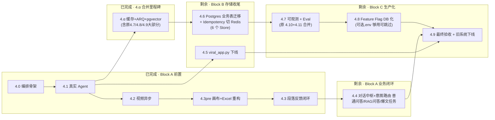

# 阶段4 核心拆解（多 Agent 编排 + 基础设施 + 生产化）

> 本文档是阶段4 的实施蓝图。作者：RedMuse 架构组。
> 配套文档：`docs/重构总计划.md`、`docs/阶段4核心拆解_b5a1641f.plan.md`（计划模式快照）。

---

## 范围统一

阶段4 承接总计划原文 4 条核心要求，并把阶段2/3 遗留的若干 P0/P1 统一闭环：


| 总计划原文                                               | 本阶段承接方式                           |
| --------------------------------------------------- | --------------------------------- |
| 拆分 `viral_app.py` 为 `api/agents/services/models` 分层 | 4.5 旧入口拆分与下线                      |
| 自然语言→采集→洞察→策略→渲染串成状态图                               | 4.0 + 4.1（LangGraph 化 + 真实 Agent） |
| 保留视频分析异步支路                                          | 4.2 视频异步支路                        |
| 复用 `viral_collector` / `viral_analyzer` 作稳定内核       | 4.1 内部直接嵌入                        |
| SQLite/JSON → PostgreSQL；缓存 → Redis                 | 4.6 / 4.7                         |


**额外承接**：阶段2/3 遗留的真实 Agent 输出、段落反馈回流、对话中枢与意图路由、上下文记忆、知识库问答、定时任务真实化、系统维护真实化、Ragas Eval、观测指标、灰度切流。

---

## 工程决策（已拍板）


| #   | 决策项                          | 最终选择                                                             |
| --- | ---------------------------- | ---------------------------------------------------------------- |
| 1   | 编排引擎                         | **LangGraph**（企业级状态图，保留 `OrchestrationEngine` 抽象层以备回滚）           |
| 2   | 后台调度                         | **ARQ（async Redis 队列）+ APScheduler（嵌入进程定时器）** ← 修订               |
| 3   | PostgreSQL 部署                | 阶段4 只做代码层准备（SQLAlchemy + Alembic），云托管选型延后到 4.13 发布前再定            |
| 4   | 旧 `web/templates/index.html` | **保留轻量维护页**（跳转到 `/login`），避免老书签 404                              |
| 5   | Feature Flag                 | **env + DB 双层**（管理员设置页可热切换） — **只做业务功能开关,不做存储双写** ← 修订           |
| 6   | 存储切换                         | **一次性硬切换**（停服维护 + 迁移脚本）,不搞 `STORAGE_BACKEND=json                 |
| 7   | Eval                         | **分层 Eval**：PR 门禁只跑确定性断言,Ragas/Promptfoo 降为 Nightly 报告不阻塞合并 ← 新增 |
| 8   | 段落级反馈                        | LLM 只生成**单个区块增量**,段落拼装/diff 在后端 Python 代码做 ← 新增                  |


---

## 落地陷阱与决策纪要（来自实战反馈）

以下 5 条是在阶段 4.0/4.1 实施过程中或专业架构评审里暴露的坑,已在本文档中落实对应章节：


| #   | 陷阱                                         | 影响章节                     | 决策                                           |
| --- | ------------------------------------------ | ------------------------ | -------------------------------------------- |
| 1   | LLM Eval 作 PR 阻塞门禁（flaky + 慢 + 贵）          | 4.10                     | 降级 Nightly 异步报告；PR 只跑确定性断言                   |
| 2   | Celery + LangGraph + DB 状态三重割裂（asyncio 冲突） | 4.2 / 4.8 / 4.9          | 换 **ARQ** + APScheduler,彻底避开 Celery          |
| 3   | 段落级反馈用 LLM 做文本 diff（指令遵循幻觉）                | 4.3                      | LLM 只重生成单段落,后端 Python 做拼装                    |
| 4   | `STORAGE_BACKEND=json                      | postgres` 双写 + 多基础设施同期重构 | 4.6 / 4.12                                   |
| 5   | 多维并发爬取触发风控                                 | 4.1（已修）                  | 分组串行 + 3s 抖动 + xhshow 签名（4.1 hotfix 1-5 已落实） |


---

## 架构原则（阶段4 继承并加强）

- **节点纯函数化**：每个 Agent 只通过 `TaskContext` 读写，禁止共享可变状态 —— LangGraph 化的前提
- **存储抽象不变**：`TaskRepository / BacklogStore / KnowledgeRegistry / IdempotencyStore` 作为稳定抽象，本阶段**只换实现**、不重写业务
- **存储切换一次到位**：不做 `STORAGE_BACKEND=json|postgres` 双写,用一次性迁移脚本 + 停服维护代替
- **单引擎双轨仅限有业务价值的场景**：LangGraph 和 SimpleEngine 双轨有工程回滚价值；但"存储双轨""队列双轨"不做
- **后台任务单入口**：所有"非用户请求工作"（定时爬虫、Cookie 巡检、清理、视频长任务）统一进 **ARQ**；禁止在 API handler 里 `asyncio.create_task(...)` 跑长任务
- **里程碑串行**：Block A（业务 Agent）稳定上线后再动 Block B（存储/队列基础设施）,避免"定位不清是哪层出问题"的组合爆炸
- **Eval 分层**：PR 只阻塞于确定性断言（JSON Schema / 关键词 / 结构覆盖），LLM-as-Judge 类 Ragas 指标只做趋势观察不拦合并
- **可观测默认开启**：每条关键路径都有 `trace_id` 贯穿 + 耗时/成功率埋点；没做观测等于没做完

---

## 子阶段总览（2026-04-20 重组版：9 项剩余 × 3 Block）

> **重组说明**：原 4.7(Redis)/4.8(ARQ+APScheduler)/4.9(定时任务) 已通过 **4.α 合并里程碑**落地完成,不再作为独立子阶段排期(章节保留作历史档案)。原 4.10(Eval) + 4.11(可观测) 合并为新 **4.7**。原 4.12/4.13 顺延为 4.8/4.9。




### 执行节奏（2026-04-27 更新）

- **已完成前置**:4.3pre 画布内容 + Excel 模板重构、4.3 段落反馈闭环、4.4 Conversation OS、4.5 旧入口下线、4.6 存储硬切、4.7 可观测 + Eval。
- **当前优先级**:4.9 最终验收与发布收口；4.8 Feature Flag DB 化仅在需要用户白名单/热切换/审计时补做。
- **已完成**:4.4 Conversation Domain / Intent Router / Knowledge QA / Task Handoff / Frontend Chat。
- **已完成**:4.5 `viral_app.py` 拆分与旧入口下线。
- **已完成**:4.6 PostgreSQL 业务表迁移 + Redis Idempotency 一次性硬切，并把 conversation/message 与 RAG chunks 纳入 PostgreSQL。
- **已完成**:4.7 trace_id 全链路、task_metrics/eval_runs、管理员系统观测区块、deterministic/nightly Eval 分层。
- **下一步**:确认 4.8 是否跳过 → 4.9(最终验收)。

### 完成度快照(2026-04-27)


| 阶段                 | 状态               | 单测         |
| ------------------ | ---------------- | ---------- |
| 4.0 编排骨架           | ✅ 完成             | 含 67 条     |
| 4.1 真实 Agent       | ✅ 完成             | 累计 ~100    |
| 4.α 缓存+队列+pgvector | ✅ 完成 + 2 轮 patch | 累计 144     |
| 4.2 视频异步           | ✅ 完成             | 累计 152     |
| 4.α RAG 维度指纹补丁     | ✅ 完成             | 累计 **156** |
| 4.3pre 画布+Excel 重构  | ✅ 完成             | 已纳入现有回归 |
| 4.3 段落反馈闭环        | ✅ 完成             | `test_paragraph_feedback_and_regen.py` |
| 4.4 对话中枢与意图路由    | ✅ MVP 完成          | conversation 系列 + 前端 lint/build |
| 4.5 viral_app.py 拆分与下线 | ✅ 完成             | `test_legacy_stub.py` |
| 4.6 PostgreSQL 业务表 + Redis Idempotency + pgvector RAG | ✅ 完成 | `test_phase46_schema_and_migration.py` + 幂等回归 |
| 4.7 可观测 + 深度 Eval | ✅ 完成 | `test_phase47_observability.py` + deterministic eval |
| 4.8 Feature Flag DB 化 | ⏸️ 可选 | 仅在需要用户白名单/热切换/审计时做 |
| 4.9 最终验收            | ⏭️ 下一步             | 待 E2E / release notes / 回滚手册 |


---

## Block A：Agent 链路真实化

### 4.0 编排引擎抽象层 + 业务 Agent + Prompt 治理（已完成）

- **目标**：阶段4 的「完整地基」。一次性建立编排抽象、新 Agent 骨架、prompt 治理框架
- **落地清单**：
  - `backend/app/application/orchestration/`（5 个文件）：
    - `engine.py`：抽象基类 `OrchestrationEngine`（`start / cancel / snapshot`）
    - `simple_engine.py`：封装现有 `AgentOrchestrator`（默认）
    - `langgraph_engine.py`：LangGraph 7 节点状态图（fan-out/fan-in）
    - `checkpoint_store.py`：`CheckpointStore` 抽象 + `MemoryCheckpointStore`
    - `factory.py`：`get_orchestration_engine()` + Feature Flag
  - `backend/app/core/feature_flags.py`：env 读取 + `ORCHESTRATION_ENGINE=simple|langgraph`
  - **8 个中粒度 Agent**（骨架 + prompt 接入）：
    - `InputParserAgent`（新）：自然语言 → 关键词 + 维度 + 调整需求
    - `CrawlerAgent`（重构）：三维采集 + 图文/视频分离
    - `ImageAnalysisAgent`（新）：图文综合分析
    - `VideoAnalysisAgent`（新，骨架）：4.2 Celery 后接入真实异步
    - `InsightAgent`（由 SemanticAgent 演变）：`asyncio.gather` 并行 3 子 prompt
    - `RAGAgent`（重构）：查询改写 + 业务约束输出（非补充素材）
    - `StrategyAgent`（重构）：`asyncio.gather` 并行 4 子 prompt
    - `CanvasRenderAgent`（更新）：模块依赖图 + 兼容三维 insight dict 结构
  - **Prompt 治理**：`backend/app/application/agents/prompts/`
    - `registry.py`：极简 PromptRegistry（文件加载 + 缓存 + 全局单例）
    - 12 个纯自然语言 `.md` prompt 文件（input_parser / insight_* / rag_* / image_* / video_* / strategy_* / canvas_render_disclaimer）
    - `README.md`：写作约定（纯自然语言、动态数据由 Agent 代码 f-string 拼接）
  - **编排链路**（6 Stage + 1 异步支路）：
  `InputParser → Crawler → ImageAnalysis → [Insight ‖ RAG] → Strategy → CanvasRender`
  （Video 骨架占位；4.2 接 Celery 激活异步）
  - **API 路由接入**：`backend/app/api/routes/tasks.py` 的 `start / retry / cancel` 全部走 `get_orchestration_engine()`
  - **测试**：`test_prompt_registry.py`（5 用例）、`test_orchestration_engine.py`（9 用例，含 LangGraph 7 节点图 + 6 Stage e2e）
- **关键决策**：
  - Agent 粒度：**中粒度 8 个**，`InsightAgent` / `StrategyAgent` 内部并发调子 prompt
  - Prompt 格式：**纯自然语言 Markdown**，不用 Jinja2，动态数据在 Python 代码侧 f-string
  - LangGraph 版本锁：`langgraph>=0.2.0,<0.3.0`
  - 未安装 LangGraph 时 factory 自动降级到 SimpleEngine
- **Feature Flag**：`ORCHESTRATION_ENGINE=simple`（默认）`| langgraph`
- **本阶段不做**：真实模型输出 / ChromaDB 真检索 / Celery 异步（留 4.1 / 4.2 / 4.8）

### 4.1 真实 Agent 输出（已完成）

- **目标**：把 4.0 搭好的 8 个 Agent 骨架里「占位数据」替换为真实采集 + 真实模型输出
- **前置**：4.0 Agent 架构对齐（8 个）+ prompt 治理框架（12 个 md 文件）
- **落地清单**：
  - **JSON 解析统一工具**：`backend/app/application/agents/_json_parsing.py` 提供 `extract_json_object`，5 层降级（think 块 / code fence / plain / greedy / narrow）；4 个 Agent 原本各自一份 `_try_parse_json` 全部替换；配套 14 条单测
  - **CrawlerAgent**：接入 `ViralNoteCollector`（L3 实时采集）
    - cookies 读取策略与 `cookie_health_service` 一致（`datas/users/<username>/cookies.json` → `admin` 回退）
    - 三维度（industry/competitor/brand）`asyncio.gather(return_exceptions=True)` 并发；每维度独立 `asyncio.wait_for(..., timeout=90s)`
    - ViralNote → 归一化 dict（保留 note_id/url/likes/media_type/dimension/keyword/cover_url/image_urls）
    - 任一维度失败只影响该维度；三维全失败或无 cookies 时降级 stub 保证画布可出
    - 输出新增 `dimension_status` 字段用于下游观察
    - L1 Redis / L2 ChromaDB 预热留给 4.7
  - **InputParserAgent**：`response_format={"type":"json_object"}` 强约束；解析失败 retry 1 次；最终失败用 hint_keywords 兜底
  - **InsightAgent**：3 子 prompt 并行 `asyncio.gather(return_exceptions=True)`；每子 retry 1 次 + 独立 fallback；样本按 `samples_by_dimension[dim]` 分流，空时回退 `note_summary`
  - **StrategyAgent**：4 子 prompt 并行；每子拼 `business_rules` 作硬约束；retry 1 次 + 每子独立 fallback 模板
  - **RAGAgent**：懒加载 `RAGService` 单例（ChromaDB 依赖缺失时标记不可用）；`rewritten_queries` 每条 `asyncio.to_thread(search, ...)`；按 `(doc_id, chunk_index)` 去重保留高分，top-5；空/失败回落占位业务规则
  - **ImageAnalysisAgent**：直接走 `ModelGateway.chat(modality="multimodal")` + `image_analysis.md`；按 likes 取 top-3 图文笔记并行分析（每条独立 60s 超时）；聚合 cover_types / opening_hooks / ocr_highlights / reproduction_advice
  - **测试**：`test_json_parsing.py`（14）、`test_agents_real.py`（13）覆盖 success / retry / full_fallback / 去重 / 超时 / 无图 等分支
  - **手动 E2E**：`USE_REAL_AGENTS=1 python -m backend.tests._manual_e2e_orchestration` 启用真实模式段，打印每 Agent 的首条真实输出片段
- **本阶段不做**（明确边界，留给后续）：
  - L1 Redis 缓存（4.7 与 Redis 一起做）
  - L2 ChromaDB 预热历史笔记（4.7）
  - Canvas section 结构化 / 新模块原型对齐（4.3）
  - VideoAnalysis 真实分析（4.2 Celery）
  - Ragas/Promptfoo 深度 Eval（4.10）
- **依赖**：4.0
- **复杂度**：★★★★
- **风险已缓解**：
  - 模型 JSON 解析偏移 → `extract_json_object` 5 层降级 + retry 1 次 + fallback 结构化
  - 小红书反爬/超时 → 三维度独立超时 + 降级 stub + emit_log 可观测
  - ChromaDB 依赖缺失 → 懒加载 + 占位业务规则
  - 多模态 API 不可用 → 每 note 独立超时 + 聚合时忽略失败项

### 4.α 缓存 + 队列 + 定时 基础设施（已完成）

阶段 4.α 是"原 4.2/4.7/4.8/4.9 的合并里程碑"——四件事技术咬合紧（都依赖 Redis），拆开做要搭 4 次环境，一起做一次性搞定。

- **目标**：接通 Redis + ARQ + pgvector 基础设施,让 CrawlerAgent 具备 L1/L2/L3 三层缓存
- **关键输出**：
  - `backend/app/infrastructure/cache/`：
    - `redis_client.py`：async Redis 单例 + 健康检查 + 降级策略
    - `keyword_cache.py`：L1 热缓存(sha1(sorted keywords) 做 key,TTL 6h)
  - `backend/app/infrastructure/storage/`：
    - `db_engine.py`：SQLAlchemy async engine(仅用于 pgvector,业务表等 4.6)
    - `notes_vector_store.py`：L2 笔记向量存储,HNSW 索引 + GIN source_keywords 索引
  - `backend/app/infrastructure/queue/`：
    - `arq_settings.py`：WorkerSettings（7 个队列函数 + 4 个 cron）
    - `client.py`：FastAPI enqueue helper
    - `runner.py`：`python -m backend.app.infrastructure.queue.runner` 启动入口
    - `tasks/`：run_analysis / video_analysis / warmup / cookie_check / cleanup / hot_queries
  - `backend/app/infrastructure/event_bus/backlog_store.py`：
    - 新增 `RedisStreamBacklog`,env `BACKLOG_BACKEND=memory|redis` 切换
  - `backend/app/application/agents/crawler_agent.py`：
    - 改造 `run()`：L1 Redis → L2 pgvector(严格同词命中 ≥10 条) → L3 实时爬
    - 新增 `cache_source: L1|L2|L3|stub` 字段
    - L3 成功后回写 L1+L2,L2 命中后回填 L1
  - `backend/app/application/orchestration/simple_engine.py`：
    - 加 `TASK_RUNNER=inprocess|arq` 切换;arq 模式走 enqueue + abort_job
  - `backend/app/api/routes/settings.py`：
    - `/crawler-status`、`/crawler/run-now`、`/maintenance`、`/maintenance/clean` 从占位改为真实
  - `docker-compose.yml`：新增 redis + postgres(pgvector) + arq-worker service
  - `scripts/pg_init/01_pgvector.sql`：pgvector 扩展 + `xhs_notes` 表 + HNSW + GIN 索引
  - 测试：16 条新增(L1 缓存 6 条 / RedisStreamBacklog 6 条 / 三层集成 4 条)
- **关键决策**：
  - 缓存命中判定 = **严格同关键词**（source_keywords && query），避免"问防脱洗发水误命中防脱精华"
  - pgvector 只装笔记,ChromaDB 保留装业务规则文档（分工清晰,避免 RAG 业务约束被笔记污染）
  - 业务表（tasks/identities/...）**不**在 4.α 迁 Postgres,保留 JSON 等 4.6 一次性切
  - ARQ 一把梭：队列 + cron 一个库（不用 Celery/APScheduler 双栈）

#### 4.α-patch：配置持久化链路 + SQL 稳定性 + 架构文档沉淀（已完成）

4.α 首轮落地后,在真实运行中暴露了一批"最后一公里"问题,统一在本轮 patch 里修完:

**① 前端配置 → 后端 → worker 全链路打通**（之前前端改了保存后端 echo 不持久化）

- 新增 `backend/app/services/system_settings_store.py` — 模型配置 / 定时预热参数 JSON 持久化
  - 路由 `GET/PUT /settings/system` 从 echo 占位改为真实读写 + 管理员鉴权
- 新增 `backend/app/services/focus_keywords_store.py` — 焦点关键词 JSON 持久化,大小写不敏感去重/长度上限/兼容老纯 list 格式
  - 路由 `GET/PUT /settings/focus-keywords` 从 echo 占位改为真实读写 + 管理员鉴权
  - `scheduled_warmup` 改为主读本 store,老 `knowledge_loader` 仅做兼容回退

**② `scheduled_warmup` 双入口 `force` 参数**（立即采集原本被 interval 节流拦截）

- `scheduled_warmup(ctx, force=False)`:
  - `force=False`（ARQ cron 每小时探针）: 受开关 + `interval_hours` 双门控
  - `force=True`（前端"立即采集"按钮）: 穿透 interval,仅受开关限制
- ARQ cron 改回每小时探针模式,让用户前端改 `interval_hours=6/12/24` 立即生效（不用重启 worker）
- `/settings/crawler/run-now` 路由 enqueue 时传 `force=True`
- 结果 summary 新增 `trigger: "scheduled"|"manual"` 字段,便于前端"上次预热"卡片区分

**③ pgvector SQL 两处修复**（用户真实触发"立即采集"时连续暴露的两个 SQL 坑）

- 坑 1: `:embedding::vector` SQLAlchemy 命名参数 + PG 双冒号类型转换混写 → `syntax error at or near ":"`
  - 改用 `CAST(:embedding AS vector)` / `CAST(:keywords AS text[])` 标准语法
- 坑 2: `CASE WHEN :embedding IS NULL THEN NULL ELSE CAST(:embedding AS vector) END` 两分支对同一参数的类型约束不一致 → `could not determine data type of parameter $N`
  - 改用 `CASE WHEN CAST(:embedding AS text) IS NULL THEN NULL ELSE CAST(:embedding AS vector) END` 统一类型约束
- 新增 `backend/tests/test_notes_vector_store_sql.py` 4 条编译期保险丝,禁止两种歧义写法复发

**④ arq_settings 导入鲁棒性**

- `_redis_settings()` / `_build_cron_jobs()` 在 arq 未安装时安全降级返回 None/[]（之前会崩导入链）

**⑤ 架构认知沉淀**

- 新增 `docs/multi_agent_architecture.md` (10 章,~500 行) — 权威架构文档
  - 8 个 Agent 的 I/O 契约表 / DAG 拓扑图 / 两种引擎对比
  - TaskContext 9 分区 / ARQ cron / 三层缓存 / SSE 事件
  - 每条断言带源文件锚点,便于手动核对

**本轮新增测试**: system_settings(7) + focus_keywords(10) + focus_keywords_api(5) + scheduled_warmup_gate(8) + notes_vector_store_sql(4) = **34 条**, 整体累积 **144 passed, 0 failed, 0 regression**

- **启动方式**：
  ```bash
  # 本地跑新后端(需 Redis + Postgres)
  docker compose up -d redis postgres
  python backend/run.py                                    # Web 进程
  python -m backend.app.infrastructure.queue.runner         # ARQ worker 进程

  # 或 docker compose up -d 一把起全部容器
  ```
- **env 开关**：
  - `CRAWLER_CACHE_ENABLED`      true(默认)/false 整条缓存层开关
  - `CRAWLER_L2_MIN_HIT`         10 L2 命中阈值
  - `CRAWLER_L2_RECENT_DAYS`     3 L2 有效时间窗
  - `BACKLOG_BACKEND`            memory(默认)/redis SSE backlog 后端
  - `TASK_RUNNER`                inprocess(默认)/arq 任务执行器
  - `REDIS_HOST` / `REDIS_PORT`  Redis 连接
  - `POSTGRES_DSN`               pgvector 连接(或 POSTGRES_HOST/PORT/USER/PASSWORD/DB)
- **依赖**：4.1
- **复杂度**：★★★★

### 4.2 视频分析异步支路（已完成）

- **目标**：视频笔记的深度分析跑在独立后台协程,不阻塞主画布产出
- **最终方案**(基于实战决策,比原规划极大简化):
  - **视频源模式 = URL 直传**(通义千问 qwen3-vl 支持 video_url content part)
    - 放弃下载 + ffmpeg 抽帧 + ASR 的重链路(那套逻辑在 viral_agent 里,不再复用)
    - 单条推理 ~30s,30 条 × 5 并发 ≈ 3 分钟,能接受
  - **执行方式 = inprocess asyncio**(非 ARQ)
    - 原因:当前默认 TASK_RUNNER=inprocess,ARQ 跨进程 TaskContext 重建是 4.9 才解的坑
    - VideoAnalysisAgent.run() 两段式:
      - 第1段(同步):写 multimodal_output.video.async_pending=True + 启动后台任务
      - 第2段(后台):asyncio.create_task fire-and-forget,并发 AI 调用
    - 模块级 `_BACKGROUND_TASKS: set[asyncio.Task]` 防 GC
  - **Stage 顺序调整**:video 节点放到 canvas 之前,让 canvas 能识别 async_pending 渲染 PENDING
- **关键输出**：
  - `backend/app/application/agents/video_analysis_agent.py`(全量重写):
    - run() 两段式,_run_background 并发 + 聚合 + SSE 推送
    - _aggregate_summary 聚合 opening_hook_types/segments_template/golden_quotes 等
  - `backend/app/application/task_service.py`:
    - 新增 update_module_content(task_id, module_id, content, status, summary) API
    - 后台任务完成后更新持久化 canvas 单模块,发 CANVAS_MODULE_UPDATED
  - `backend/app/domain/events.py`:
    - 新增 TaskEventType.TASK_VIDEO_DONE
  - `backend/app/application/orchestrator.py` + `langgraph_engine.py`:
    - DONE payload 新增 video_pending 标志(让前端 SSE 保活)
    - LangGraph graph 把 video 节点放到 strategy → video → canvas 链上
  - **前端**:
    - `event-source-client.ts`:done 带 video_pending 时不关流,等 task_video_done;10 分钟 watchdog 兜底
    - `event-reducer.ts` + `contracts.ts`:新增 task_video_done 类型与 videoAsyncState 字段
    - `canvas-adapter.ts`:mod-video-analysis 专用 sections(pending 骨架 + 完整渲染 + ICON)
  - **单测**:
    - test_video_analysis_async.py(6 条):立即返回/无视频/全成功/部分失败/全失败/top-N 限制
    - test_task_video_done_event.py(2 条):事件 payload 格式 + DONE 带 video_pending
- **门控参数(可通过 env 调整)**：
  - VIDEO_ANALYSIS_MAX_COUNT=30         单任务视频上限(默认 30,按点赞 top-N)
  - VIDEO_ANALYSIS_CONCURRENCY=5        任务内并发数
  - VIDEO_ANALYSIS_PER_TIMEOUT=60       单条 AI 推理超时(秒)
- **失败降级**：
  - 单条视频抛异常 → 记 failed_notes,不影响其他
  - 全部失败 → module 状态 FAILED,TASK_VIDEO_DONE.failed == total
  - 后台任务被取消(主任务 cancel) → TASK_VIDEO_DONE.reason="cancelled"
- **依赖**：4.1(Agent 链路)、4.α(ARQ/Redis 基础设施 — 但 4.2 不用 ARQ)
- **复杂度**：★★(比原规划 ★★★ 简化)
- **决策对比**:
  - ❌ 原方案:下载视频 + ffmpeg + ASR + ARQ 队列,多套依赖半套配置
  - ✅ 实际:URL 直传 + inprocess asyncio,一个文件改完,代码量 < 400 行
  - 若未来 AI 部署海外访问不了 xhscdn,或单任务视频 > 100 条,再升级到 ARQ + 下载模式
- **测试结果**:152 passed(上轮 144 → 本轮 +8,零回归)

### 4.3pre 画布内容与导出模板重构（2026-04-20 基准确定）

- **触发原因**(2026-04-20 初始化):探查 4.3 时发现原计划"paragraph_id 增量定位"的隐含前提不成立,画布结构 + Excel 模板都要改
- **基准文档**(2026-04-20 用户提供):
  - 用户提供了 `docs/templates/抗老精华爆文模型—兴长信达.xlsx`(98MB, 7 sheet, 257 图片)作为**项目最终画布/导出的权威参考**
  - 完整分析 + 新 schema 设计 见 `**[docs/canvas_restructure_spec.md](docs/canvas_restructure_spec.md)`**(权威基准文档)
- **核心洞察(摘自 spec v1.0)**:
  - 模板本质是"**爆文模型 × 6 要素**"矩阵分析法,不是传统分析报告
  - 4 个爆文模型: 单品推荐 / 手持单推 / 干货分享 / 知识科普
  - 6 要素固定: A 封面 / B 封面压字 / C 标题 / D 内容切入点 / E 产品引出方式 / F 产品植入方式
  - Sheet 层级:4 种数据源(品类 Top / 竞品 / 互动 Top / SERP 前 10) + 2 种统计归纳 + 1 草稿
- **新 Canvas 模块(原 11 → 新 9)**:
  - ✅ `mod-overview-stats` 统计总览(内容方向分布 + 痛点 Top)
  - ✅ `mod-viral-model-matrix` **爆文模型矩阵**(核心,树形手风琴)
  - ✅ `mod-source-samples` 品类 TOP 样本
  - ✅ `mod-competitor-samples` 竞品样本
  - ✅ `mod-top-interaction-samples` 互动 TOP 样本
  - ✅ `mod-serp-top-samples` SERP 前 10 屏样本
  - ✅ `mod-seo-insights` SEO 热搜 + 评论热词
  - ✅ `mod-pain-points` 皮肤问题 Top
  - ✅ `mod-draft-workbench` 创作草稿区
  - ❌ 删除原 4 个 strategy 模块 + 3 个 insight 模块 + video_analysis(融入新模块)
- **Agent 改造清单**:
  - CrawlerAgent → 四路采集(category_top / competitor / top_interaction / serp_top)
  - **VideoAnalysisAgent → 主力产出方**(2026-04-20 用户强调): 视觉大模型分析视频内容,直接输出 N/O/P/Q/R/S 六要素标注;复用 4.2 的 URL 直传 + asyncio 基础设施
  - ImageAnalysisAgent → 图文笔记版 6 要素标注器(输出同 schema)
  - **新建 ViralModelAgent** 替换原 StrategyAgent(聚类 2-6 个爆文模型 + 矩阵统计)
  - InsightAgent 简化(内容方向统计 + SEO 聚合仅竞品 + 痛点 Top)
- **子阶段拆分(见 spec 第 7 章)**:
  - ✅ 4.3pre.1 数据模型重构(2026-04-20 完成,15 测试新增)
  - ✅ 4.3pre.2 Agent 改造(2026-04-16 完成,16 测试新增 → 总 179 passed)
  - 4.3pre.3 CanvasRenderAgent 重构(1-2 天)
  - 4.3pre.4 前端 canvas-adapter 重写(2-3 天)
  - 4.3pre.5 Excel 导出实现(2-3 天) — openpyxl 生成 7 sheet + 嵌入封面图
  - 4.3pre.6 联调 + 回归(1-2 天)
- **5 大决策(2026-04-20 已确认,详见 spec 第 8 章 v1.1)**:
  - ✅ Q1 爆文模型: AI 动态识别 2-6 个(品类自适应)
  - ✅ Q2 要素枚举: 软编码 taxonomy.json + AI 可扩展
  - ✅ Q3 编辑语义: bias_hint(下次重生偏好提示)
  - ✅ Q4 SEO 范围: 只做竞品 sheet(对齐模板)
  - ✅ Q5 视频分析: **主力产出方**,复用 4.2 基础设施；4.4 已升级为对话中枢后,该决策归档在 4.3pre 范围内
- **依赖**:决策已齐,可开工
- **复杂度**:★★★ (工作量 ~11-18 天,约 2.5 周)

### 4.3 段落级反馈闭环

- **目标**：用户"赞/踩/删/编辑"不仅是 UI，还影响下次重生
- **关键输出**：
  - `POST /tasks/{id}/modules/{mid}/paragraphs/{pid}/feedback`（action: like / dislike / delete / edit / **reset**）
    - **reset**：清除该 `paragraph_id` 在 `feedback_map` 中的条目（用于前端「取消赞/踩」）
  - **持久化位置**（2026-04-20 调整）：
    - ❌ 原计划的 `TaskContext.canvas_document.feedback_map` **不可行**：TaskContext 是进程内内存,主任务 done 后随 `task_context_store.drop` 丢失
    - ✅ 新方案:写 `**CanvasModule.content.feedback_map: { paragraph_id: Feedback }`**
    - 好处:`feedback_map` 跟着 canvas 一起被 `task_service.set_canvas` / `update_module_content` 持久化(4.6 迁 Postgres 后自然跟上)
  - **段落重生规则（陷阱 3 决策）**：
    - **不再经过已下线的 `StrategyAgent`**。主链路以 `AgentOrchestrator`（`ViralModel` → `Sheet2Narrative` → `Insight`/`RAG` → `CanvasRender`）为准；定向重生由 **`module_regeneration` 执行器**在同进程 `asyncio.create_task` 中跑（4.3 首版，与 ARQ 全量后台任务规范的关系见 4.8 演进）。
    - `POST .../regenerate` 扩展 body：`paragraph_id`、`feedback_hint`；校验乐观锁后进入 `GENERATING` 并 **实际调度** `run_module_regeneration`：按 `paragraph_id` 前缀路由 → **ParagraphRefinementAgent（LLM）只产出单个子树 JSON** → Python 在 `viral_model_output` / `semantic_output` / 样本行上做 **确定性合并** → 矩阵变更后 **重跑 `Sheet2NarrativeAgent`** 保持 Sheet2 叙事与矩阵一致 → `update_module_content` 写回并通过 SSE 推送 **完整模块快照**（`canvas_module_updated`）。
    - `feedback_map` 里 `edit` 的原文作为重生 prompt 的参考；`delete` 对矩阵/痛点/SEO 条目标记删除或走模型移除分支。
  - 前端：`EditableParagraph`、矩阵分类条、痛点/SEO/样本表行等带 `paragraph_id` 处调用 feedback API；`regenerate` 携带最近交互的 `paragraph_id`（同模块内）。
- **依赖**:**4.3pre(阻塞前置)**、4.1、4.2(复用 `update_module_content` API)
- **复杂度**：★★
- **决策：不让 LLM 做段落 diff**（陷阱 3）
  - 原规划里让 Agent prompt 处理"第一段保持不变、第二段稍微修改、第三段重写"属于幻觉灾难区
  - GPT-4 / Claude 3.5 都处理不好这种"精细指令遵循"
  - **改为**：LLM 只负责生成**单个区块的增量**，后端 Python 代码做段落拼装
- **测试清单（PR 门禁）**：
  - `backend/tests/test_paragraph_feedback_and_regen.py`：`paragraph_id` 路由解析、feedback 持久化、reset、`regenerate` 调度参数
  - 定向合并与 Sheet2 联调：建议在具备 LLM mock 的集成用例中覆盖（勿将 flaky LLM 调用放进 PR 阻塞）

### 4.4 对话中枢与意图路由

- **目标**：把前端左侧对话区从“创建一次分析任务的输入框”升级为真正的 Conversation OS。用户可以在同一会话中普通问答、基于知识库问答、触发小红书爆文模型多 Agent 任务，也可以在已有 Canvas 上追加调整指令。
- **现状约束**：
  - 前端 `ChatPanel` 当前只保存一条 `lastUserInput`，发送动作直接 `POST /tasks`，有 `taskId` 时再次发送会创建新任务并切换上下文，不是多轮对话。
  - 后端 `api_router` 当前只有 `auth/health/tasks/history/knowledge/settings`，没有 `conversations/messages` 路由。
  - 现有 `/knowledge/search` 是管理员检索测试接口，不应直接作为用户侧 RAG 问答 API 暴露。
  - `RAGAgent` 在任务内定位是“业务硬约束”，对话中需要新增 Knowledge QA 层来组织面向用户的答案。
- **前端承接边界（按当前 UI 定 MVP）**：
  - 4.4 首版只改造现有左侧对话区：消息气泡、引用展开、任务进度气泡、输入框状态和 Canvas 联动。
  - 不新增独立 Trace 页面、链路追踪抽屉、入库监控台或模型健康控制台。
  - 知识库引用只做“答案下方可展开来源”，不做复杂检索调试视图。
  - 任务进度继续复用现有 `AgentProgress` / SSE reducer，不重做一套任务流 UI。
- **外部参考（ragent → RedMuse 转译）**：
  - 4.4 MVP 可借鉴：树形意图分类 + 低置信度澄清、多轮问题重写/拆分、滑动窗口 + 摘要记忆、多路检索 + 后处理链。
  - 暂缓借鉴：Trace 控制台、复杂模型熔断、MCP 工具注册、文档入库 Pipeline；这些需要额外前端 UI 和运维面板,放到 4.7 可观测或后续增强。
  - 不照搬：Java/Spring Boot/Milvus/RocketMQ/MCP 管理后台；RedMuse 继续使用 FastAPI、Next.js、`ModelGateway`、ChromaDB、Redis/ARQ、现有 `KnowledgeRegistry` 和任务 SSE。
  - 产品差异：ragent 是通用企业 RAG 问答平台；RedMuse 的对话中枢必须额外具备 `xhs_analysis` 与 `refine_canvas`，能把用户意图交接到现有爆文多 Agent 流程和 Canvas。

#### 4.4.0 设计冻结与安全边界（0.5 天）

- 冻结 4.4 的意图枚举、消息结构、RAG 引用结构、任务交接结构，避免前后端边做边漂移。
- 明确权限：
  - `Conversation` / `Message` 按 `owner_user_id` 隔离。
  - 用户侧 Knowledge QA 只能读自己有权访问的 `domain_ids/doc_ids`；管理员 `/knowledge/search` 仍仅用于调试。
  - `xhs_analysis` 仍受 Cookie 健康检查约束，不能因走对话入口绕过登录态。
- 明确首版不做：
  - 不做独立 MCP 工具平台。
  - 不做 Milvus 替换 ChromaDB。
  - 不做链路追踪 UI / Trace 查询页；首版只保留必要日志与错误码,便于后端排查。
  - 不做全量流式 token 输出；首版可以同步返回 assistant 消息，任务进度仍复用 `/tasks/{id}/stream`。
- 交付物：
  - 更新 `docs/refactor_phase0_ui_api_contract.md` 的 4.4 API 契约。
  - 补 `backend/tests/test_conversation_contract.py` 的空壳/契约断言（实现阶段补齐）。

#### 4.4.1 Conversation Domain

- 新增领域对象与存储抽象：
  - `Conversation`: `conversation_id`、`owner_user_id`、`title`、`active_task_id`、`summary`、`created_at`、`updated_at`、`metadata`。
  - `Message`: `message_id`、`conversation_id`、`role(user|assistant|system|tool)`、`content`、`intent`、`intent_confidence`、`citations`、`linked_task_id`、`created_at`。
  - `KnowledgeCitation`: `doc_id`、`chunk_index`、`title`、`snippet`、`score`。
  - `TaskHandoff`: `task_id`、`status`、`raw_input`、`keywords`、`canvas_url_hint`。
- 存储策略：首版可使用 JSON 文件存储以贴合当前 `TaskRepository/KnowledgeRegistry`；4.6 PostgreSQL 迁移时一并切到业务表，避免长期多进程文件写入风险。
- 上下文记忆：
  - 短期记忆：最近 N 轮消息直接拼入模型上下文。
  - 长期记忆：每轮后维护 `conversation.summary`，只保存与用户业务目标、品牌/品类、已绑定任务、关键约束相关的信息。
  - 任务记忆：`active_task_id` 绑定最近一次爆文模型任务，供后续 `refine_canvas/export` 使用。
- 推荐落点：
  - `backend/app/domain/conversation.py`
  - `backend/app/services/conversation_store.py`
  - `backend/app/application/conversation_service.py`
  - `backend/app/api/routes/conversations.py`
- 测试：
  - 创建/读取会话。
  - 追加 user/assistant 消息。
  - owner 隔离。
  - `active_task_id` 写入与恢复。
  - JSON Store 重启恢复。

#### 4.4.1b Conversation Memory（ragent 记忆压缩转译，1 天）

- 采用“滑动窗口 + 摘要压缩”：
  - 最近 6-10 条消息作为短期上下文。
  - 超出窗口后触发摘要更新，摘要只保留用户目标、品类/品牌、当前任务、知识库领域、用户偏好、待办指令。
  - 摘要更新失败不阻塞主回答，只记录普通日志并保留旧摘要。
- 首版触发策略：
  - 每次 assistant 回复后，如果消息数超过阈值则异步更新摘要。
  - 先用 `asyncio.create_task` 或轻量同步实现；4.6/4.7 后可切 ARQ。
- 测试：
  - 超过窗口后不会把全量消息塞进 prompt。
  - 摘要保留 `active_task_id` 和用户指定品牌/关键词。
  - 摘要失败时用户消息仍能正常保存。

#### 4.4.2 Intent Router

- 新增 `IntentRouter`，输入为用户消息、会话摘要、最近消息、当前 Canvas 模块摘要、知识库领域列表，输出：
  - `general_qa`: 普通产品/业务/系统使用问题，直接回答。
  - `knowledge_qa`: 需要查知识库、行业规则、品牌 SOP、历史案例或上传文档的问题。
  - `xhs_analysis`: 用户要求搜索关键词、采集小红书、生成爆文模型矩阵或分析爆文规律。
  - `refine_canvas`: 用户要求修改已有 Canvas 模块、段落、模型、样本或洞察。
  - `export`: 用户要求导出 Excel/JSON。
- 借鉴 ragent 的树形意图，但压缩为 RedMuse 两级结构：
  - 一级：`chat` / `knowledge` / `xhs_task` / `canvas_action` / `export`。
  - 二级：`general_qa`、`knowledge_qa`、`xhs_analysis`、`refine_canvas`、`export`。
- 输出结构：
  - `intent`
  - `confidence`
  - `reason`
  - `clarification_needed`
  - `clarification_question`
  - `target_module_ids`
  - `extracted_keywords`
  - `domain_ids`
  - `should_retrieve_knowledge`
- 路由原则：
  - 不把所有输入都送入多 Agent 流程；只有 `xhs_analysis` 才创建/启动 `Task`。
  - `knowledge_qa` 可以检索知识库并回答，但不强制生成 Canvas。
  - `refine_canvas` 复用 4.3 的 `module_regeneration` 和 `paragraph_id` 能力。
- 低置信度策略：
  - `confidence < 0.65` 且可能创建任务/修改 Canvas 时，不执行动作，返回澄清问题。
  - 普通闲聊低置信度可降级 `general_qa`。
- 推荐落点：
  - `backend/app/application/conversation/intent_router.py`
  - `backend/app/application/agents/prompts/conversation_intent_router.md`
- 测试：
  - “小红书搜防晒，生成爆文模型” → `xhs_analysis`。
  - “知识库里护肤合规怎么说” → `knowledge_qa`。
  - “这个产品植入太硬，改自然点” + 有 `active_task_id` → `refine_canvas`。
  - “导出 Excel” + 无 `active_task_id` → `export` + 引导。
  - 模糊输入“帮我看看这个” → `clarification_needed=true`。

#### 4.4.2b Question Rewrite & Split（ragent 问题重写转译，0.5-1 天）

- 只在 `knowledge_qa` 和 `xhs_analysis` 前使用，不给所有消息增加成本。
- `knowledge_qa`：结合会话摘要把“它/这个/刚才那个”补全成可检索 query，复杂问题拆成 2-3 个子 query。
- `xhs_analysis`：提取 1-5 个关键词、竞品词、时间范围、图文/视频偏好，尽量复用现有 `InputParserAgent` 的语义。
- 测试：
  - 多轮里“那它的合规限制呢”能补成前文品类/品牌。
  - “防晒和抗老分别有什么爆文结构”能拆成两个检索/分析维度，但不自动创建两个任务，首版提示用户确认范围。

#### 4.4.3 Knowledge QA

- 新增用户侧知识库问答服务，内部复用 `RAGService` / ChromaDB 检索，但与管理员 `/knowledge/search` 分离。
- 检索流程：
  1. 根据用户问题和会话摘要生成 1-3 条检索 query。
  2. 可按 `domain_ids` 或领域关键词过滤。
  3. 召回 top-k 分块，按 `(doc_id, chunk_index)` 去重。
  4. 将片段、标题、来源元数据交给 `ModelGateway.chat` 生成回答。
  5. 返回 `assistant` 消息和 `KnowledgeCitation[]`，前端可展开来源。
- 失败策略：ChromaDB/Embedding 不可用时，明确告诉用户“当前知识库检索不可用”，再退化为普通回答，不伪造引用。
- 借鉴 ragent 的“多通道检索 + 后处理链”，RedMuse 首版采用轻量三通道：
  - `DomainKeywordChannel`：按领域关键词/文档 metadata 过滤，优先召回相关领域。
  - `VectorChannel`：现有 ChromaDB 相似度检索。
  - `RecentTaskContextChannel`：如果有 `active_task_id`，读取当前 Canvas summary / `rag_output.business_rules` 作为补充上下文。
- 后处理链：
  - 去重：`(doc_id, chunk_index)`。
  - 截断：每 chunk snippet 限长，控制 prompt token。
  - 排序：先按 domain 命中，再按 similarity。
  - 引用清洗：只返回实际参与生成的引用。
- 推荐落点：
  - `backend/app/application/conversation/knowledge_qa_service.py`
  - `backend/app/application/conversation/retrieval_channels.py`
  - `backend/app/application/conversation/retrieval_postprocessors.py`
- 测试：
  - Chroma 可用时返回 citation。
  - Chroma 不可用时不伪造 citation。
  - 同一 chunk 多 query 命中只保留一次。
  - domain 过滤不越权。
  - 有 `active_task_id` 时可把当前 Canvas 摘要纳入回答上下文。

#### 4.4.3b Debug Metadata（轻量调试信息，0.25 天）

- 4.4 MVP 不建立完整 Trace 链路，也不新增前端追踪 UI。
- 仅在后端日志和 message metadata 中保留轻量字段：
  - `intent.reason` / `intent.confidence`
  - `rewrite_queries`
  - `retrieval_summary`: 各检索通道命中数量
  - `model_error_code`（仅失败时）
- 这些字段默认不在前端展示；后续 4.7 可观测阶段如确有需要，再升级为独立 Trace Store 和管理后台。
- 测试：失败时用户仍收到可读 assistant 消息，后端日志包含 intent 和错误码。

#### 4.4.4 Task Handoff

- 当意图为 `xhs_analysis`：
  - 调用现有 `TaskService.create_task` 与 `get_orchestration_engine().start(task_id)`。
  - 将 `task_id` 写入当前 `Conversation.active_task_id`，并在 assistant 消息中返回任务启动说明。
  - 前端继续复用 `GET /tasks/{task_id}/stream` 接收 `agent_progress/canvas_schema_updated/canvas_module_updated`。
- 当意图为 `refine_canvas`：
  - 读取当前 `active_task_id` 和 Canvas 模块摘要。
  - 路由到目标 `module_id` / 可选 `paragraph_id`。
  - 调用现有 `/tasks/{id}/modules/{mid}/regenerate` 或后端内部 RefineLoop。
- 当意图为 `export`：
  - 如果存在 `active_task_id`，触发现有导出接口。
  - 如果没有任务，返回需要先生成爆文模型的引导。
- 幂等策略：
  - 每条 user message 生成 `message_id`，作为创建任务的幂等来源之一。
  - 同一 `message_id` 重放时不重复创建任务，返回已有 `TaskHandoff`。
- 测试：
  - `xhs_analysis` 创建任务后 `Conversation.active_task_id` 更新。
  - 同一消息重放不重复建任务。
  - Cookie 过期时返回 assistant 引导，不创建任务。
  - `refine_canvas` 找不到模块时返回澄清，不直接全量重跑。

#### 4.4.5 Frontend Chat

- `ChatPanel` 改造为真实消息流：
  - 渲染 `ChatMessage[]`，而不是只渲染 `lastUserInput` + 固定进度气泡。
  - 输入发送到 `/conversations/{id}/messages`，由后端返回 `assistant` 消息、`intent`、可选 `task_handoff`。
  - 当返回 `task_handoff.task_id` 时，调用现有 `startTask` 并订阅任务 SSE。
  - 任务 `agent_progress` 可以作为 assistant 的进度型消息插入，Canvas 仍走右侧 `CanvasView`。
  - 知识库回答展示引用来源，普通回答不展示 Canvas。
- `WorkspaceProvider` 增加 `conversationId/messages/activeTaskId`，保持切页不丢失当前对话。
- 前端子步骤：
  - `contracts.ts` 增加 `Conversation/ChatMessage/IntentClassification/KnowledgeCitation/TaskHandoff`。
  - `workspace-context.tsx` 增加 conversation 状态、消息 patch、active task 同步。
  - `page.tsx` 的发送逻辑改为先确保 conversation，再 `POST /conversations/{id}/messages`。
  - `chat-panel.tsx` 拆出 `MessageList`、`MessageBubble`、`CitationList`、`TaskProgressBubble`。
  - 有 `task_handoff` 时复用现有 `startTask` 与 `useTaskStream`。
- 测试/验证：
  - 无任务时普通问答不展开 Canvas。
  - 知识库问答展示引用。
  - 触发任务后保留聊天消息并展开 Canvas。
  - 切换页面再回工作台，对话仍保留。

#### 4.4.6 Model Gateway 容错与限流（ragent 模型路由转译，0.5-1 天）

- 现有 `ModelGateway` 已有 provider/profile 抽象，4.4 首版不重写模型层，只补对话入口必要保护：
  - 对 `general_qa/knowledge_qa/intent_router/summary` 设置不同 `agent_id`，便于模型策略分流。
  - 每个对话请求设置超时和 max_tokens。
  - 模型失败时返回可读 assistant 错误，不丢 user message。
  - 记录模型错误到普通日志和 message metadata，供 4.7 可观测阶段复用。
- 可延后到 4.7 的增强：
  - 首包探测。
  - 多候选模型自动降级链。
  - 用户级并发队列/Redis 限流。

#### 4.4.7 Test & Acceptance Matrix（1-1.5 天）

- 后端单测：
  - `test_conversation_store.py`
  - `test_intent_router.py`
  - `test_knowledge_qa_service.py`
  - `test_conversation_messages_api.py`
  - `test_task_handoff.py`
- 前端静态检查：
  - `npm run lint`
  - TypeScript 类型检查。
- 手工 E2E：
  - 普通问答三轮，不创建任务。
  - 知识库问答有 citation。
  - 小红书爆文需求创建任务并生成 Canvas。
  - 任务完成后追加一句修改指令，触发局部重生。
  - 刷新/切页后恢复 conversation。

#### 4.4.8 Rollout & Feature Flag（0.5 天）

- 新增 env flag：
  - `CONVERSATION_OS_ENABLED=true|false`
  - `CONVERSATION_KNOWLEDGE_QA_ENABLED=true|false`
- 回滚策略：
  - flag 关闭时，前端退回当前 `POST /tasks` 单次任务入口。
  - `/tasks`、Canvas、SSE 不受 conversation 层影响。
  - 对话 JSON Store 可保留，不影响任务历史。

- **依赖**：4.1、4.3(feedback_map 与 module_regeneration 已具备定位基础)、Knowledge 页面/RAG 上传能力。
- **复杂度**：★★★★
- **建议排期**：约 6-8 个工作日，先后端骨架和路由，再 Knowledge QA，再前端真实聊天，最后接 Task Handoff 和 refine_canvas。
- **验收标准**：
  - 同一会话中连续三轮普通问答不创建任务。
  - 用户问“知识库里关于某领域的规则是什么”时能返回带 citation 的回答。
  - 用户说“搜索小红书关键词 X，生成爆文模型”时创建任务并生成 Canvas。
  - Canvas 生成后，用户说“把产品植入改成更自然”能定位并触发相关模块重生。
  - 刷新页面后能恢复会话消息、摘要和当前 `active_task_id`。

---

## Block B：基础设施升级

### 4.5 viral_app.py 拆分与下线（已完成）

- **目标**：旧入口能力提取到 `backend/app/`，彻底下线旧 Jinja 页
- **关键输出**：
  - 逐 endpoint 分类：
    - **已迁移**：删除
    - **值得保留**：提取逻辑到 `backend/app/api/routes/` 新路由（走新契约）
    - **CLI 性质**：移到 `scripts/` 作独立脚本
  - `web/templates/index.html` 替换为「请使用新版 RedMuse → 跳转 /login」的维护页
  - `docs/phase4_deprecation_list.md`：删除清单 + git tag 标注回滚点
  - 下线后 `viral_app.py` 文件本身保留一个空 stub（或彻底删除，由决策4 定）
- **依赖**：4.1 稳定后
- **复杂度**：★★
- **完成记录(2026-04-27)**:
  - 新增 `docs/phase4_deprecation_list.md`，逐 endpoint 标注已迁移/废弃/脚本化/兼容去向。
  - `viral_app.py` 降级为维护 stub：`/` 返回维护页，`/health` 返回 legacy_stub，旧 `/api/*` 返回 410 并提示新 `/api/v1` 替代入口。
  - `web/templates/index.html` 降级为轻量维护/跳转页。
  - `Dockerfile`、`docker-compose.yml`、`nginx/nginx.conf`、`scripts/start_viral_agent.py` 切到新后端 `backend.app.main` / 8100。
  - 新增 `backend/tests/test_legacy_stub.py` 覆盖旧入口 smoke。

### 4.6 PostgreSQL 业务表迁移 + Idempotency 切 Redis（已完成）

- **目标**：业务数据存储从 JSON 文件全面切到 PostgreSQL；幂等键同步切 Redis；RAG 向量主链路从 ChromaDB 切到 pgvector。
- **完成状态(2026-04-27)**:
  - **业务 Store 已切 PostgreSQL**:
    - `TaskRepository`(tasks 表)
    - `IdentityStore`(identities 表)
    - `KnowledgeRegistry`(knowledge_domains + knowledge_documents 表)
    - `SystemSettingsStore`(system_settings 表,single-row 配置)
    - `FocusKeywordsStore`(focus_keywords 表)
    - `ConversationStore`(conversations + conversation_messages 表)
  - **跨进程基础设施已硬切**:
    - `IdempotencyStore` → Redis(`RedisIdempotencyStore`,Lua 保证 begin 原子性)
    - `RedisStreamBacklog` → Redis(已由 4.α 完成)
    - `KeywordCache` → Redis(已由 4.α 完成)
  - **向量存储已统一到 pgvector**:
    - `NotesVectorStore` → `xhs_notes`
    - `RAGService` → `knowledge_chunks`
    - ChromaDB 退出新后端主链路；旧数据如需使用，通过源文档重新向量化。
  - **暂不迁**:
    - `TaskContextStore`(9 分区内存 dict,迁移需要 JSONB + 版本戳,留 4.9 最终验收前评估是否仍有必要)
- **关键输出**：
  - `backend/app/infrastructure/db/`:
    - `engine.py`:同步 SQLAlchemy engine/session，服务业务表 Store
    - `schema.py`:业务表 DDL + `knowledge_chunks vector(N)`
    - `stores.py`:统一导出 SQLAlchemy Store
  - Alembic 迁移脚本(`alembic/versions/20260427_0001_phase46_business_tables.py`):业务表 + pgvector RAG chunks
  - **SQLAlchemy Store 实现**:
    - `SqlAlchemyTaskRepository`
    - `SqlAlchemyIdentityStore`
    - `SqlAlchemyKnowledgeRegistry`
    - `SqlAlchemySystemSettingsStore`
    - `SqlAlchemyFocusKeywordsStore`
    - `SqlAlchemyConversationStore`
  - **Redis Idempotency**:
    - `RedisIdempotencyStore`(Redis key + Lua script 保证原子写)
    - TTL = 24h,key 格式 `idem:{hash(key)}`
    - 并发 begin 失败时返回 409，避免重复执行写请求。
  - **一次性迁移脚本** `scripts/migrate_json_to_postgres.py`:
    - 从 `datas/*.json` 导入 tasks/identities/knowledge/system_settings/focus_keywords/conversations
    - 幂等:基于主键 upsert
    - 失败可回滚:保留 JSON 快照并可重复导入
  - Docker Compose 已补齐 `BUSINESS_POSTGRES_DSN`，FastAPI lifespan/health 已纳入 business_db + Redis 检查。
- **依赖**:Block A(4.3/4.4)已完成；pgvector 的 Postgres 服务已启动。
- **复杂度**:★★★(原评估)→ **★★★(实际)**,因为额外纳入 ConversationStore 与 RAGService pgvector 化。
- **决策:一次性硬切换而非 `STORAGE_BACKEND=json|postgres` 双轨**(陷阱 4):
  - 双轨要同时维护两份 CRUD 逻辑 + 保持数据同步,工程复杂度翻倍
  - 我们是 B2B 内部产品,没有线上流量,宁可发一次"停服维护 30 分钟"的公告
  - 切换方式:
    1. 所有 `SqlAlchemy*Store` 实现齐全并通过单测
    2. 停服 → 跑 `migrate_json_to_postgres.py` → 切配置 → 起服务
    3. 保留 `datas/*.json` 快照作为回滚点(一周不删)
  - **放弃**: `STORAGE_BACKEND` env flag
- **风险**:数据迁移脚本须严格幂等,失败可回滚到 JSON 快照

### 4.7 Redis 迁移（已并入 4.α / 4.6,整章下沉）

> **状态(2026-04-20)**:原计划的 Redis 迁移三项已拆成两段完成/合并:
>
> - ✅ `RedisStreamBacklog` → **4.α 已实装**(`BACKLOG_BACKEND=memory|redis` 可切)
> - ✅ `RedisIdempotencyStore` → **4.6 已完成**，与业务表一起硬切换
> - ⏸️ `ModelResponseCache` → **降级为可选**,4.7(新)可观测阶段如果需要再做
>
> 本章作为历史档案保留,**不再作为独立子阶段排期**。

### 4.8 ARQ 后台队列 + APScheduler 定时器（已完成于 4.α,整章下沉）

> **状态(2026-04-20)**:原计划的 ARQ + APScheduler 技术决策已落地:
>
> - ✅ ARQ WorkerSettings + Worker 进程 → `[backend/app/infrastructure/queue/arq_settings.py](backend/app/infrastructure/queue/arq_settings.py)`
> - ✅ `run_analysis_task`(TASK_RUNNER=arq 可切) → `[tasks/run_analysis.py](backend/app/infrastructure/queue/tasks/run_analysis.py)`
> - ✅ 4 个 cron 任务(`scheduled_warmup` / `cookie_health_check` / `cleanup_tmp` / `rebuild_hot_queries`)
> - ❌ **APScheduler 被 ARQ cron 替代**(更好的决策:不需要独立 scheduler 进程,ARQ worker 原生支持 cron)
> - ⏸️ `run_video_analysis` ARQ 版本是占位,4.2 实际走 inprocess asyncio;未来若单任务视频量 > 100 条再激活
>
> **技术决策(ARQ vs Celery)归档保留**,作为未来新 worker 工作流的依据:
>
> - Celery 原生同步,FastAPI + LangGraph 全 async 栈下易死锁
> - ARQ 纯 async + Redis,FastAPI 作者同款生态
>
> 本章作为历史档案保留,**不再作为独立子阶段排期**。

---

## Block C：生产化

### 4.9 定时任务真实化（已完成于 4.α / 4.α-patch2,整章下沉）

> **状态(2026-04-20)**:原计划三项全部实装:
>
> - ✅ **定时爬虫预热** → `scheduled_warmup` ARQ cron(每小时探针 + `interval_hours` 节流 + `force=True` 立即采集穿透);结果写 Redis `crawler:last_run`
> - ✅ **Cookie 巡检** → `cookie_health_check` cron,每 4 小时写 Redis
> - ✅ **系统维护清理** → `cleanup_tmp` cron,`/settings/maintenance[/clean]` 真实扫描删除
> - ✅ **前端"立即采集"按钮** → `POST /settings/crawler/run-now` enqueue `scheduled_warmup(force=True)`
> - ❌ **crawler_status 历史表** → 当前只有 Redis 快照,没做 Postgres 历史表
>   - 工程量不大,可在 4.6 Postgres 迁移时顺手加一张 `crawler_run_history` 表作为子任务
>   - 或者保持 Redis only(单机够用)
>
> 本章作为历史档案保留,**不再作为独立子阶段排期**。

### 4.7 可观测 + 深度 Eval（已完成，合并原 4.10 + 4.11）

- **目标**:任务耗时 / 模型调用量 / P95 / Eval 质量趋势全部可见;PR 门禁稳定可信
- **为什么合并**:两件事都依赖同一个 `task_metrics` / `eval_runs` Postgres 表,合并一次性做省往返
- **完成状态(2026-04-27)**:
  - `trace_id` 已通过 HTTP middleware / Task input_spec / Orchestrator / ModelGateway / SSE payload 串联。
  - `task_metrics` / `eval_runs` 已纳入 business schema 与 Alembic revision。
  - `ModelGateway._record_audit` 已同步写 `model_call` 指标。
  - `AgentOrchestrator` 与 `LangGraphEngine` 已记录 `task_run` 与 `agent_stage` 指标。
  - `GET /api/v1/metrics/summary` 已提供管理员聚合接口。
  - 前端设置页已新增管理员"系统观测"简版区块。
  - Eval 已注册 `deterministic` / `nightly` / `requires_llm` markers，并新增 `scripts/run_eval_nightly.py` 写入 `eval_runs`。
- **关键输出**：
  **A. 可观测(原 4.11)**
  - `trace_id` 贯穿全链路:HTTP middleware → Orchestrator → ModelGateway → SSE 事件
  - 指标入 Postgres:`task_metrics` 表(task_id / agent / duration_ms / tokens / status / trace_id)
  - **复用 ModelGateway 现有 `_record_audit` 逻辑**(`backend/app/llm/model_gateway.py:353`),只需把 audit log 输出到 task_metrics 表
  - `/api/v1/metrics` 简易 JSON 聚合(吞吐 / 失败率 / P50 / P95)
  - 管理员"系统观测"页:
    - 近 24h 任务吞吐曲线
    - 失败分类 TopN(按 ErrorCode 分类)
    - 模型调用审计(哪个 agent 调了哪个 profile、耗时、token)
  - 可选:`/metrics` Prometheus 端点
  **B. 深度 Eval(原 4.10)**
  - **决策:分层 Eval 策略**(陷阱 1)
    - **PR 门禁层(同步、必须稳定)**:只跑确定性断言(JSON Schema / 关键词命中 / 模块结构),秒级执行,0 flaky
    - **Nightly 异步层(LLM-as-Judge)**:Ragas + Promptfoo,写 `eval_runs` 表,**绝不阻塞 PR**
  - **为什么不做 PR 阻塞**(业界共识):LLM-as-Judge 极不稳定、慢、贵
  - 关键输出:
    - `backend/tests/eval/`:PR 同步跑的确定性断言(已用 `pytest.mark.deterministic` 标记)
    - `scripts/run_eval_nightly.py`:nightly runner,当前跑 deterministic 基线并写 `eval_runs`
    - `backend/tests/eval/nightly/ragas/`:后续可扩展的异步 Ragas 评估集 + 指标计算脚本
    - `backend/tests/eval/nightly/promptfoo/`:后续可扩展的 Promptfoo YAML + assertions
    - `eval_runs` 表:存 nightly 指标时序数据
    - 管理员 `/admin/eval` 页:近 30 天趋势 + 按 agent 分维度
    - GitHub Actions:
      - `pr-check.yml`:PR 触发,只跑 deterministic
      - `nightly-eval.yml`:每天 02:00 触发 Ragas/Promptfoo(结果入库)
- **依赖**:4.6(Postgres `task_metrics` + `eval_runs` 表)
- **复杂度**:★★★

### 4.8 Feature Flag DB 化（原 4.12,降级为可选）

- **目标**：业务功能可灰度切换,支持用户白名单;**env flag 已足够用的情况下可跳过**
- **现状(2026-04-20)**: 当前已有大量 env-based flags 够用日常开发:
  - ✅ `ORCHESTRATION_ENGINE=simple|langgraph`(factory 已实现)
  - ✅ `TASK_RUNNER=inprocess|arq`(SimpleEngine 已实现)
  - ✅ `BACKLOG_BACKEND=memory|redis`(EventBus 已实现)
  - ✅ `CRAWLER_CACHE_ENABLED=true|false`
  - ✅ `VIDEO_ANALYSIS_MAX_COUNT/CONCURRENCY`(4.2 新增)
- **何时需要做 DB flag?**
  - 需要**按用户白名单**灰度(如"只给管理员开 Video Deep Analysis")
  - 需要**运行时热切换**(不重启)
  - 需要**审计**谁何时开关了哪个 flag
- **关键输出(如果做)**：
  - `backend/app/core/feature_flags.py`:优先读 DB(`feature_flags` 表),缺省走 env
  - `feature_flags` 表:`flag_key` / `enabled` / `whitelist_user_ids` / `updated_by` / `updated_at`
  - 业务功能开关:
    - `SEGMENT_FEEDBACK_ENABLED`(4.3 完成后)
    - `CONVERSATION_OS_ENABLED`(4.4 完成后,包含普通问答/知识库问答/爆文任务路由)
    - `APPEND_INSTRUCTION_ENABLED`(4.4 中作为 refine_canvas 子能力完成后)
    - 未来新业务 Agent 的开关
  - **不做**(陷阱 4 决策):
    - `STORAGE_BACKEND` / `BACKLOG_BACKEND` / `IDEMPOTENCY_BACKEND` — 存储/基础设施类的 env flag 保留(4.6 一次性硬切,不需要 DB 控制)
  - 管理员设置页"发布控制"区块(切换 + 白名单)
- **依赖**:Block A(4.3/4.4) + 4.6 完成
- **复杂度**:★★(若做);★(若只保持 env flag)

### 4.9 最终验收与旧系统下线（原 4.13）

- **目标**：总计划验收门槛达标 + 旧 `viral_app.py` 彻底下线
- **关键输出**：
  - 全量 E2E 回归:扫码 → 创建会话 → 普通问答 → 知识库问答 → 触发爆文任务 → SSE → 画布真实 → 模块写 → 导出 → 重试 → 段落反馈 → 对话追加指令 → 视频支路
  - 性能验收:核心 API P95 < 2s、成功率 > 95%、Eval 基线通过
  - 删除旧入口:`/` 路由直接是新前端;旧 Jinja 不可访问
  - `CHANGELOG.md` + `docs/release_notes_v3.md` + 回滚手册
- **依赖**:前置所有子阶段(4.3/4.4/4.5/4.6/4.7/4.8)
- **复杂度**:★★

---

## 代码组织（2026-04-20 实际目录 + 待新增）

```
backend/app/
├── application/
│   ├── orchestration/            # ✅ 4.0 已完成
│   │   ├── engine.py
│   │   ├── simple_engine.py      # inprocess / arq 双模式
│   │   ├── langgraph_engine.py
│   │   ├── checkpoint_store.py
│   │   └── factory.py
│   ├── agents/                   # ✅ 4.0/4.1/4.2 已完成
│   │   ├── input_parser_agent.py # 任务内输入解析;4.4 意图路由由 Conversation OS 承接
│   │   ├── crawler_agent.py
│   │   ├── image_analysis_agent.py
│   │   ├── video_analysis_agent.py  # 4.2 两段式已完成
│   │   ├── insight_agent.py
│   │   ├── rag_agent.py
│   │   ├── strategy_agent.py
│   │   └── canvas_render_agent.py
│   ├── orchestrator.py           # SimpleEngine 底层 8-Agent 编排
│   └── task_service.py           # update_module_content API(4.2 新增)
├── services/                     # ✅ 4.α-patch 新增
│   ├── system_settings_store.py  # ✅ 4.6 已切 Postgres
│   ├── focus_keywords_store.py   # ✅ 4.6 已切 Postgres
│   ├── identity_store.py         # ✅ 4.6 已切 Postgres
│   ├── conversation_store.py     # ✅ 4.6 已切 Postgres
│   └── knowledge_registry.py     # ✅ 4.6 已切 Postgres
├── core/
│   └── feature_flags.py          # ⏳ 4.8(若需要 DB)
└── infrastructure/
    ├── cache/                    # ✅ 4.α 已完成
    │   ├── redis_client.py
    │   └── keyword_cache.py
    ├── db/                       # ✅ 4.6 业务表同步 SQLAlchemy 基础设施
    │   ├── engine.py
    │   ├── schema.py
    │   └── stores.py
    ├── storage/                  # ✅ 4.α 已完成
    │   ├── db_engine.py          # 复用到 4.6 业务表
    │   └── notes_vector_store.py # pgvector(笔记向量)
    ├── queue/                    # ✅ 4.α 已完成
    │   ├── arq_settings.py       # WorkerSettings + cron
    │   ├── client.py             # enqueue 助手
    │   └── tasks/                # run_analysis / warmup / cookie_check / cleanup / hot_queries
    ├── event_bus/                # ✅ 4.α 已完成
    │   ├── task_event_bus.py
    │   └── backlog_store.py      # memory + redis_stream 双后端
    ├── repository/               # ✅ 4.6 从 JSON 切 Postgres
    │   └── task_repository.py
    └── observability/            # ⏳ 4.7
        ├── trace.py
        └── metrics.py

alembic/
└── versions/                     # ✅ 4.6 业务表迁移脚本

backend/tests/eval/
├── deterministic/                # ⏳ 4.7(PR 同步跑)
├── ragas/                        # ⏳ 4.7(nightly)
└── promptfoo/                    # ⏳ 4.7(nightly)

scripts/
├── pg_init/01_pgvector.sql       # ✅ 4.α 已完成
└── migrate_json_to_postgres.py   # ✅ 4.6 已完成

docker-compose.yml                # ✅ 4.α redis + postgres + arq-worker 已就位

docs/
├── 阶段4核心拆解.md              # 本文档(2026-04-20 重组)
├── multi_agent_architecture.md   # ✅ 架构权威参考(4.α-patch 新增)
├── phase4_deprecation_list.md    # ✅ 4.5
└── release_notes_v3.md           # ⏳ 4.9
```

---

## 验收门槛（2026-04-20 重组版）

### 业务

- 真实分析链路成功率 ≥ 95%（开发环境连续 100 次任务）
- 画布 4+ 个模块内容均来自真实 Agent 输出（非占位）
- 段落反馈 / 对话中枢(普通问答+知识库问答+爆文任务路由) / 追加指令 / 视频支路四条次级闭环可跑通
- Cookie 巡检自动发现过期并通知(✅ 4.α 已完成)

### 架构

- `viral_app.py` 旧入口零引用,Jinja 模板仅保留跳转维护页
- **6 个业务 Store 100% 走 PostgreSQL**: Task/Identity/Knowledge/SystemSettings/FocusKeywords/(Idempotency 走 Redis)
- SSE backlog 100% 走 Redis(✅ 4.α 已完成)
- Idempotency 100% 走 Redis(✅ 4.6 已完成)
- **后台任务 100% 走 ARQ**(✅ 4.α 已完成;原"Celery"决策已废弃)
- 向量存储统一 pgvector:**`xhs_notes` 装笔记 / `knowledge_chunks` 装业务规则文档**(✅ 4.6 已完成)

### 可观测

- 全链路 `trace_id` 可追
- 管理员"系统观测"页显示 24h 吞吐 / P95 / 成功率 / 模型调用
- 核心 API P95 < 2s

### 质量

- Ragas Eval 基线通过(**nightly,不阻塞 PR**)
- Promptfoo JSON Schema 校验 100% 通过
- 后端单测 ≥ 180 条全绿(当前 156)

### 发布

- **env Feature Flag 齐全**(✅ 已有 ORCHESTRATION_ENGINE/TASK_RUNNER/BACKLOG_BACKEND 等)
- DB Feature Flag 可选(4.8,视业务需求)
- 回滚开关齐全(每个 Block 独立可回滚)

---

## 风险登记


| 风险                   | 缓解                                 |
| -------------------- | ---------------------------------- |
| LangGraph 依赖升级破坏 API | 锁死 minor 版本，CI 固化 requirements.txt |
| 模型 JSON 解析失败率高       | 重试 + 兜底静态模板 + Eval 监控              |
| Celery 任务重复/丢失       | 强幂等键 + Redis lock + 明确 retry 策略    |
| Postgres 迁移数据丢失      | 迁移脚本幂等，失败回滚到 JSON + 全量再跑           |
| 视频分析内存溢出             | 并发上限 + 单任务超时 + 独立 Celery queue     |
| 旧入口下线后遗漏功能           | 下线清单 + 回归测试 + 保留 1 个 tag 回滚        |


---

## 下一步动作(2026-04-27 4.7 完成后)

1. **当前基线**:4.3pre、4.3、4.4、4.5、4.6、4.7 均已完成；4.6 额外完成 RAGService pgvector 化与 Ollama native embed 兼容。
2. **下一步决策**:4.8 Feature Flag DB 化是否跳过。若短期不需要用户白名单、运行时热切换和审计，建议跳过。
3. **下一步执行 → 4.9 最终验收**:
  - 全量 E2E:扫码 → 对话 → 知识库问答 → 触发爆文任务 → SSE → Canvas → 模块写 → 导出 → 重试 → 段落反馈 → 追加指令 → 视频支路。
  - 跑 deterministic eval 与核心后端/前端回归。
  - 补 `CHANGELOG.md` / `docs/release_notes_v3.md` / 回滚手册。
  - 确认旧入口、旧模板、旧接口兼容层是否可最终删除或保留维护跳转。
4. **每个子阶段完成**:MemPalace 归档(drawer + kg + diary),更新本文档完成度快照。
5. **每个 Block 完成**:做一次小型回归(pytest + E2E),更新验收门槛 checklist。

---

*Updated: 2026-04-27 (4.7 可观测 + Eval 完成;下一步确认 4.8 是否跳过并进入 4.9 最终验收)*
*Previous: 2026-04-20 (重组,反映 4.α 合并后的实际现状)*

---

## 附录 B: 4.3pre.2 Agent 改造实施记录(2026-04-16)

### 实际落地

| 改动项 | 文件 | 说明 |
| --- | --- | --- |
| CrawlerAgent 四源视图 | `backend/app/application/agents/crawler_agent.py` | 新增 `_build_four_source_view()`, 把三维采集映射到 category_top/competitor/top_interaction/serp_top 4 源,每条 note 携 sources_hit |
| VideoAnalysisAgent 重写 | `backend/app/application/agents/video_analysis_agent.py` | 回退 fire-and-forget,改同步并发 (Semaphore=5),输出 8 字段标注 schema |
| ImageAnalysisAgent 对齐 | `backend/app/application/agents/image_analysis_agent.py` | 输出 schema 与 Video 一致,共享 multimodal_output.annotations dict (深 merge) |
| ViralModelAgent 新建 | `backend/app/application/agents/viral_model_agent.py` | 替换 StrategyAgent;混合聚类 = direction 粗分 + LLM 起名 + coverage<5% 阈值过滤 |
| InsightAgent 简化 | `backend/app/application/agents/insight_agent.py` | 从 3 次 LLM 并行降为 1 次,内部适配回旧 semantic_output schema 保持 canvas 兼容 |
| Orchestrator 拓扑 | `backend/app/application/orchestrator.py` | 新拓扑: Input → Crawler → [Image‖Video] → ViralModel → [Insight‖RAG] → Canvas |
| LangGraphEngine 拓扑 | `backend/app/application/orchestration/langgraph_engine.py` | 8 节点同上,删 strategy 节点 |
| TaskContext 分区 | `backend/app/domain/task_context.py` | _VALID_PARTITIONS 新增 `viral_model_output` |
| DONE payload | orchestrator + langgraph_engine | 移除 video_pending(视频已同步) |
| Prompt 体系 | `backend/app/application/agents/prompts/` | 新增 video_6elements.md / image_6elements.md / viral_model_naming.md / insight_summary.md |

### 测试

- 删除: test_video_analysis_async.py (8 条) + test_task_video_done_event.py (2 条)
- 改写: test_agents_real.py 4 条(insight 2 + image 2) + test_orchestration_engine.py 2 条
- 新增 16 条:
  - test_crawler_four_sources.py: 4 条
  - test_video_agent_6elements.py: 3 条
  - test_image_agent_6elements.py: 2 条
  - test_viral_model_agent.py: 5 条
  - test_orchestrator_new_topology.py: 2 条
- **总数**: 158 → 179 passed (零回归)

### 关键决策

- 聚类策略 = 方案 C 混合(content_direction 粗分 + LLM 起名 + 阈值过滤)
- Video 角色 = 方案 b2 同步并发(Semaphore=5,主流程 await 完整完成)
- 多 Agent 写同一 dict 用深 merge(读-update-写),避免浅 merge 互覆盖
- StrategyAgent 类保留但不再被调用,canvas 4 个旧策略 module 内容空(待 4.3 清理)
- prompt 字段名英文 + 中文枚举值 + _OTHER 兜底防 LLM 幻觉

### 后续

- 4.3pre.3 CanvasRenderAgent 重构: 新增 mod-viral-model-matrix 渲染分支,清理 4 个旧策略 module
- 4.3pre.4 前端 canvas-adapter 重写: 适配新模块 schema
